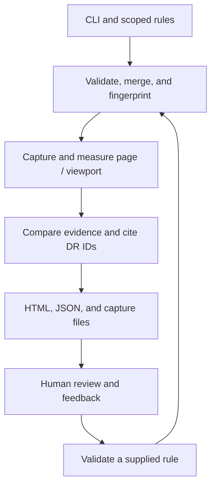

#  Viewrule

**Design guidance and executable UI constraints for coding agents.**

Viewrule gives agents explicit design boundaries before they choose a layout,
then checks the rendered result with browser measurements and visual evidence. It preserves detail across large
viewports and turns human feedback into reusable constraints. The agent operates
the tool and repairs the application; the human supplies intent and judgment.

The Claude Code plugin brings this workflow into UI tasks. Its local CLI engine
opens the running app in Chromium, checks configured constraints, and reports
violations with evidence and design-rule citations. Other agents and CI can use
the same CLI directly.

**Status:** experimental 0.6.0, distributed through
[GitHub Releases](https://github.com/lanej/viewrule/releases). No npm registry release
is available yet. Node.js 22.18+ and npm are required. Linux is exercised in CI;
macOS and Windows have not been validated.

See [how Viewrule compares with related design and UI tooling](docs/comparison.md)
for overlap, complementary uses, tradeoffs, and the evidence behind its current
positioning.

## Incremental review (unreleased)

Declare explicit input/dependency scopes, then use `viewrule plan --incremental`
and `viewrule check --incremental` to reuse verified unchanged evidence. A complete
report still covers every required page, viewport, checkpoint, and source provider;
shared changes invalidate dependents. `check --full` always captures again.
Reuse requires a nonsecret environment identity and an explicit maximum age.
See [configuration, evidence provenance, and conservative fallbacks](docs/incremental-review.md).

## Why it exists

A UI can look polished while making a decision harder: too few alternatives fit on
screen, related values sit far apart, chart context disappears, or a larger window
adds empty space while hiding useful detail. Telling a coding agent to “make it
better” leaves those expectations implicit and makes the next revision unpredictable.

Visual assessment also loses fidelity when a large screenshot is shrunk to fit an
agent's image input or a review window. An overview can show composition while
concealing small labels, clipping, and alignment errors. Viewrule retains native-scale
detail tiles alongside the overview so those details can be inspected.

The goal is to turn an expectation such as **“show eight complete carrier rows on
desktop”** into a repeatable check, while keeping judgment with the person using the
interface. The [design policy](docs/design-rules.md) includes DR-001 through DR-016.
The first eight draw on Tufte's work on comparison and graphical integrity; the
next eight address state, continuity, action clarity, recovery, hierarchy, input
access, content resilience, and semantic color. Each states its scope and limits.
These are our interpretations, not quotations, universal thresholds, or endorsements.

See [good and bad design examples](docs/design-examples.md) for illustrated rule
explanations and an offline interactive gallery covering drawers, text and diagrams,
tabs, menus, numeric alignment, and comparison spacing, plus full hamburger and
sidebar workspaces with filters, a shipment queue, and selected parcel details.

The [complete mock application](docs/mock-application.md) combines those elements
with charts, a searchable shipment queue, carrier comparisons, and a Design lab
for deliberate violations. [Open the Pages site](https://lanej.github.io/viewrule/)
or run `npm run site:preview` from a checkout. Deployment is tracked by the `pages`
job in the repository's existing CI workflow.

Viewrule began in [lanej/dotfiles](https://github.com/lanej/dotfiles/pull/29). A separate
repository gives the engine its own releases and lets any application or agent use it.
Dotfiles retains personal preferences and installation choices; each application owns
its selectors, viewport choices, and thresholds.

[Component relationships](docs/component-relationships.md) cover per-item visual
presence, bounded peer spacing independent of grid/flex CSS, and opt-in SVG
continuity across list and detail pages. Exact sizes and layout preferences stay
in the application contract.

## Consult guidance before building

The [versioned design guide](plugins/claude-code/guide/v1/index.md) covers decision
context, progressive disclosure, action lists, Tufte, and graphical perception.
It separates conditional patterns, original evidence, and enforceable measurements.
The existing Pages build renders the same Markdown under `guide/v1/`, with raw
`.md` pages and a generated `index.json`; no second prose copy is maintained.

```sh
viewrule guide          # compact local index; no project or browser needed
viewrule guide P-003    # one Markdown page on action lists
viewrule guide E-CARBON # just the selected evidence record
```

These commands ship with this source change; older engine releases do not include
them. The updated plugin supplies `guide [ID]` independently of its pinned engine,
so its review skill can consult bundled guidance before setup. Read only relevant
pages, state decision assumptions, inspect examples, implement, then run checks.
The runnable pricing and encoding examples compose Easy UI components from a pinned
commit. The [source manifest](plugins/claude-code/guide/v1/examples.json) records
provenance and checksums; generated assets ship offline without adding Easy UI to
the engine’s dependencies.
See [guide contribution instructions](plugins/claude-code/guide/v1/authoring.md).

## Define boundaries before building

Run `viewrule contract` to inspect effective rules and configuration before changing
a React or other web application. The agent identifies the task and required
comparisons, applies those boundaries, then measures the rendered result. Different
compositions can satisfy the same contract. The React fixtures demonstrate that
with compact and sidebar layouts at desktop and 4K.

Use `/viewrule:add-rule` in Claude Code, or `schema` and `add-rule --rule <file>
--dry-run` through the CLI, to author a scoped addition. Reports preserve contract
snapshots and distinguish constraint changes from application repairs. See
[rule authoring](docs/rule-authoring.md) and [research behind the defaults](docs/design-principles.md).

See the [synthetic decision-surface pair](docs/examples/decision.html) for a large-map
operations analysis with shared good/bad content, scoped executable checks, and
explicit human-review limits. Its [catalog](docs/examples/decision-catalog.json)
records the rules and expected findings.

See the [new rule examples](docs/examples/behavior.html) for paired good/bad
interaction and resilience demonstrations, shared synthetic data, cited rationales,
and explicit native-check versus application-review coverage.

## What it detects

| Concern | Evidence Viewrule checks |
| --- | --- |
| Layout | Alignment of declared peers, overlap, clipping, component height, control bounds, and page overflow |
| Comparison | Required visible item counts and stable identities preserved across viewports |
| Context and consistency | Visible context, allowed styles or attributes, and consistent declared encodings |
| Density and legibility | Adjacent text distance, minimum text size, and optional text/box coverage or empty-band constraints |
| Capture and accessibility | Complete detail-tile coverage and automatically detectable axe accessibility findings |

Rule findings report their selector, observed value, expected value, reason, and
applicable DR IDs. Setup and capture errors report the failed operation. Reports
separate executed checks from unassessed design requirements; a pass means the
configured error checks passed. See the [detection manual](docs/ui-review-enforcement.md)
for the exact scope and limits of each measurement.

## How to use it

### Claude Code

In Claude Code, install the plugin and initialize it in your application's repository:

```text
/plugin marketplace add lanej/viewrule
/plugin install viewrule@viewrule
/reload-plugins
/viewrule:setup
```

Setup installs a checksummed engine release and Chromium, then helps configure your
app with a baseline or analytical preset. `/viewrule:review` guides design decisions,
runs checks, and inspects the rendered result. `/viewrule:feedback` records your
actual feedback against a specific report.
Claude can also select these skills when relevant. Repairs follow the scope of your
request, and only human feedback can establish an approved visual reference.

The plugin includes an opt-in Stop hook; installation leaves enforcement off.
See the [plugin guide](https://github.com/lanej/viewrule/blob/main/plugins/claude-code/README.md)
for configuration, existing dotfiles-hook migration, updates, and removal.

### CLI, other agents, or the demo

Download `viewrule-0.6.0.tgz` and `SHA256SUMS` from the
[v0.6.0 release](https://github.com/lanej/viewrule/releases/tag/v0.6.0).
From that download directory, verify the checksum and install:

```sh
# Linux; on macOS use: shasum -a 256 -c SHA256SUMS
sha256sum -c SHA256SUMS
npm install --global ./viewrule-0.6.0.tgz
viewrule install-browser
viewrule --version
```

Browser installation is explicit. For Linux CI system dependencies, use
`viewrule install-browser --with-deps`. To inspect a sample without configuring an app,
run the demo from a source checkout:

```sh
git clone https://github.com/lanej/viewrule.git
cd viewrule
npm ci
npm run browser:install
npm run demo
```

The demo prints an HTML gallery for the same broken, compact, stretched, and finite
comparison fixtures used by the preset regression. It includes desktop and 4K
reports, uses illustrative data, and does not record human approval.

### Run quick source diagnostics

Viewrule 0.6.0 includes pinned Impeccable source diagnostics. From a source
checkout, use `node bin/viewrule.mjs lint --project /path/to/app --target src`.
Older engines through 0.5.1 do not have `lint`; upgrade through explicit setup.

```sh
viewrule lint --target src
```

This returns general diagnostics without a running app, browser, or agent review.
New projects include Impeccable as an advisory provider; existing configurations
are preserved. Source-only passes do not assess rendered requirements or satisfy
the Stop hook. Run `check` when the application's layout, data presentation, or
interaction requirements need verification. See [Impeccable integration](docs/impeccable.md)
for configuration, findings, and deliberate enforcement.

### Configure a real application

Start your application's development server, then run these commands in its repository:

```sh
viewrule init --url http://localhost:3000
# For an analytical workspace, add --preset analytical to init.
# Calibrate .ui-review/config.json and its starter rules for your application.
viewrule check
```

`init` does not overwrite existing configuration. Choose routes, a readiness selector
that proves the intended data has loaded, and representative browser sizes. Initial
configs include desktop, wide, large, 4K, and mobile viewports; dimensions are **CSS
pixels**, not the monitor's hardware resolution. Use stable fixture data for comparisons.
Viewrule does not start the application's server.

### The default opinion

`guidance` includes seven built-in preferences adapted from the original dotfiles:
lead with the decision, keep comparisons visible, preserve quantitative context,
align evidence, minimize distracting decoration, retain readable density, and
review graphical integrity. Personal preferences and actual human feedback refine them.

New projects get editable **baseline** rules: 14px main-content text, clipping
warnings, and a warning for headers over 160px. **Analytical** adds declared
comparison identities, eight desktop/twelve large-screen alternatives, nearby
text values, complete labels, shared context, and aligned metric peers. These are
calibratable starting constraints; a finite task can require fewer alternatives.
Neither preset imposes a viewport occupancy score.

Use `viewrule init --preset analytical --url ...` for a new comparison workspace,
or `viewrule preset --name analytical` to inspect rules for an existing application.
The [defaults guide](docs/defaults.md) documents exact thresholds, annotations,
scope, and limitations. Upgrading never replaces an application's rules.

### Calibrate comparison rules

For example, suppose the configured `main` page contains a carrier table. Put this
array in `.ui-review/rules.json` to require eight complete rows in the initial desktop
viewport; adapt the selector and minimum to the actual task:

```json
[
  {
    "id": "carrier-rows-visible",
    "type": "visible-count",
    "selector": "[data-testid=carrier-table] tbody tr",
    "min": 8,
    "pages": ["main"],
    "viewports": ["desktop"],
    "severity": "error",
    "reason": "Compare eight carriers together without scrolling.",
    "designRules": ["DR-006"]
  }
]
```

The example applies only to desktop. Use `comparison-set` for explicit cross-viewport
identity preservation and minimum counts; see the [rule reference](docs/ui-review.md).
An empty custom-rule list still checks overflow, accessibility when enabled, and
capture integrity. It does not establish that the application's design policy is covered.

### Inspect, adjust, and learn

`viewrule check` prints JSON containing findings and paths to the HTML and JSON reports.
Open the HTML overview for composition and the affected detail tiles at original size
for labels, spacing, and clipping. Tiles default to 1024×800 with overlap; incomplete
capture coverage fails the check. The program cannot establish that a person or agent
actually inspected every relevant tile.

Record feedback against the exact report the person reviewed:

```sh
viewrule feedback --report .ui-review/runs/RUN/report.json \
  --decision adjust --note 'Show eight complete carrier rows on desktop.'
# Save the single rule object above, without the array, to rule.json.
viewrule learn --feedback FEEDBACK_ID --rule rule.json
# Repair the application and capture a fresh report.
viewrule check
viewrule feedback --report .ui-review/runs/NEW_RUN/report.json \
  --decision approve --note 'This comparison layout works.'
```

Replace `RUN`, `NEW_RUN`, and `FEEDBACK_ID` with the actual run paths and returned ID.
`learn` validates supplied rule JSON and links it to recorded feedback; it does not
infer thresholds from prose. Subjective feedback remains guidance, available through
`viewrule guidance`. Approval preserves the exact report and screenshots, and never
clears automated failures. Default to project scope; use `--scope global` only for
preferences explicitly intended to apply across projects.

### Enforce a result

| Result | Exit code |
| --- | --- |
| Configured error checks pass; warnings may remain | `0` |
| A check or capture fails | `1` |
| Usage or configuration is invalid | `2` |

Run the CLI in application CI for a required gate. The optional Claude Stop hook
requires a current passing result when the application sets `enforceOnStop: true`;
initial configs leave it off. It checks source/rule freshness without launching a
browser. Its continuation guard prevents loops, so it is an iteration aid rather
than a substitute for a required CI check. See [integrations](docs/integrations.md).

## How it is architected

Viewrule is a Node.js CLI orchestrating Chromium through Playwright. Ajv validates
configuration and rules; Impeccable supplies general source diagnostics, and axe
supplies automated accessibility checks. It uses local
JSON, JSONL, HTML, and PNG files, with no hosted service, database, model API, or
telemetry. The configured application can make its own browser network requests.
The Claude plugin packages skills, a release installer, and the existing Stop-hook
protocol. It invokes the CLI and reads that engine version's docs; it does not copy
measurement logic. Using the plugin involves Claude's normal model service.



| Layer | Implementation and responsibility |
| --- | --- |
| Claude integration | `plugins/claude-code/`: task guidance, pinned setup, and Stop-hook adapter; `.claude-plugin/marketplace.json` provides discovery |
| Entry and configuration | `bin/viewrule.mjs`, `src/cli.mjs`, `src/config.mjs`, `src/paths.mjs`: commands, schema validation, and configuration lookup |
| Browser evidence | `src/review.mjs`, `src/capture.mjs`, `src/checks.mjs`: fresh contexts, geometry, styles, accessibility, and full-resolution tiles |
| Design evaluation | `src/design.mjs`: policy loading, cross-viewport comparisons, coverage, citations, and remediation suggestions |
| Reports and state | `src/report.mjs`, `src/templates/`, `src/state.mjs`: rendered reports, fingerprints, feedback provenance, approved references, and Stop decisions |

A check fingerprints scoped source and rules before and after capture; changes during
the run fail it. Each page/viewport gets a fresh browser context. Observations are
compared across viewports, then reported against a snapshot of the design policy.
The CLI is the supported integration boundary; internal modules are not a library API.

Application configuration, rules, feedback, and approved references live under
`.ui-review/`; run output and `latest.json` are disposable. Global rules and preferences
default to `$XDG_CONFIG_HOME/viewrule` or `~/.config/viewrule`, overridden by
`VIEWRULE_CONFIG_DIR`. Project rules override global rules by ID. The `ui-review`
command alias and legacy environment variables remain supported. The
[architecture guide](docs/architecture.md) details ownership, storage, and trust boundaries;
the [lifecycle guide](docs/lifecycle.md) covers release, upgrade, rollback, and removal.

## Limits and next work

**Useful density still requires judgment.** Box coverage can reward empty stretched
tables. The analytical preset therefore checks visible identities, readable type,
and distance between actual text values. Its regression fixtures reject stretching
alone and accept bounded finite comparisons with surrounding whitespace. These
checks cannot establish relevance or every source of comparison effort. The
[fixture corpus](https://github.com/lanej/viewrule/blob/main/test/README.md) states exactly
what is verified; further work is tracked in the [roadmap](https://github.com/lanej/viewrule/blob/main/ROADMAP.md).

DOM evidence cannot certify chart truth, semantic context, every form of clipping
or occlusion, or overall design quality. Native-scale captures preserve evidence;
they do not replace inspection. The CLI offers remediation suggestions and does
not edit application code. Automatic repair is deferred until its measurements
are reliable enough to avoid optimizing the wrong thing.

## Development and review

The [analytical benchmark](benchmarks/analytical/README.md) compares the installed
Viewrule CLI and pinned Impeccable detector on shared synthetic interfaces. It
publishes the task contract, seeded cases, raw findings, and measurement limits.

From a source checkout, run `npm ci`, then `npm run format` to apply Prettier and
`npm run check` to verify formatting, ESLint, and TypeScript JavaScript analysis.
CI runs these before the browser regression. Static checking is incremental, with
JSDoc contracts and `strict: false`; runtime inputs still require Ajv validation.
There is no compilation step. Use `npm run browser:install` and `npm test` for the browser workflow. The single representative regression workflow installs
the packed CLI through an isolated plugin copy, then exercises 4K evidence, feedback,
repair, and stale-review enforcement against the shipped presets. The same workflow
checks broken, compact, sidebar, stretched, finite, and missing-annotation cases with specific
finding assertions. It does not evaluate Claude's visual judgment.
For documentation-only changes, use targeted link, example, and diff checks instead
of adding tests or rerunning the browser locally.

[CONTRIBUTING.md](https://github.com/lanej/viewrule/blob/main/CONTRIBUTING.md) covers changes and validation.
[AGENTS.md](https://github.com/lanej/viewrule/blob/main/AGENTS.md) defines shared coding-agent instructions;
`CLAUDE.md` imports them. [REVIEW.md](https://github.com/lanej/viewrule/blob/main/REVIEW.md)
is the shared review rubric, used by the project Claude reviewer and summarized in
GitHub Copilot instructions. Reviewer guidance does not enable automatic reviews or
configure branch protection. See [SECURITY.md](https://github.com/lanej/viewrule/blob/main/SECURITY.md)
for artifact privacy and reporting. MIT licensed.
