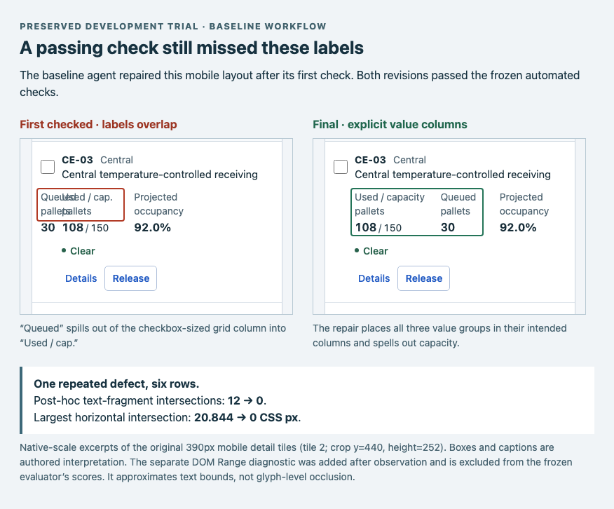
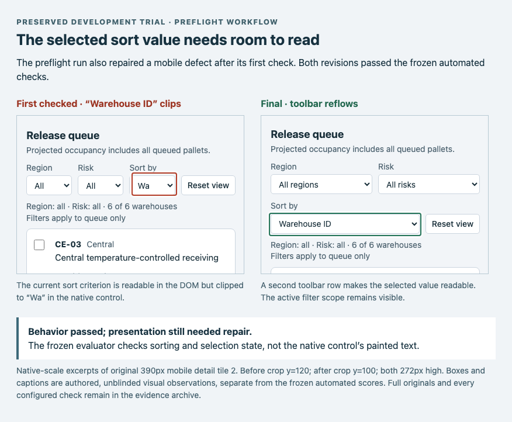

# Capacity desk: preflight trial, 2026-09-25

**No prevention or efficiency advantage was established.** Both workflows' first
and final implementations passed the frozen automated checks. Both first attempts
contained a different mobile presentation defect visible in their original captures,
and both repaired it. Both sessions reached the token budget before a final reply.
The preflight session used more elapsed time and one more checked source revision
in this pair; that is an observation, not a causal estimate.

This is one fresh, complex generation task with one session per arm. It tests the
marginal effect of explicitly invoking the composition preflight, with the rest of
the review workflow held constant. It does not estimate general prevention,
reliability, design quality, or cost improvements.

## Fixed conditions

The [frozen protocol](../capacity-trial-protocol.md) defines the six-warehouse task,
required decision fields, shared-scale histories, filtering, persistent selections,
guarded releases, and desktop/mobile acceptance. Both arms received the same data,
DESIGN.md, configured rules, tools, and evidence preservation. The baseline skill
omits two preflight-invocation paragraphs; the treatment retains them. Both have
access to the same guide and companion files. Actual preflight reads are recorded
in the session ledger.

Codex CLI 0.153.4, gpt-6-astra with ultra reasoning, one fresh ephemeral session per
arm, baseline first, eight minutes and 600,000 cumulative reported tokens per
session. The total includes cached input; actual usage can cross the limit at the
next notification. The shared engine archive is pinned by SHA-256. The task and
harness hashes were frozen before generation. The tested archive was used while
release CI ran; the published 0.10.0 asset later matched its bytes exactly. The trial
browser was Chromium 151.0.7922.34 selected with `VIEWRULE_BROWSER_PATH`. Protected
inputs are checked after each session. Read isolation is an instruction boundary, not a sealed container.

## Outcomes

| Observation | Baseline | Explicit preflight |
| --- | --- | --- |
| First / final configured findings | 0 / 0, all three viewports | 0 / 0, all three viewports |
| First / final independent failures | 0 / 0, all three viewports | 0 / 0, all three viewports |
| First visual defect observed | Overlapping mobile value labels | Clipped mobile selected sort text |
| That defect in final captures | Repaired | Repaired |
| Agent check calls | 2 | 3 |
| Post-first checked source revisions | 1 | 2 |
| Controller final check | 1 | 1 |
| Protected input changes | None | None |
| Generation stopping reason | Token limit | Token limit |

The explicit preflight file content was returned to the treatment session and was
not observed in the baseline's command outputs. This records retrieval, not proof
of understanding. Both sessions reported the requested model with no reroute event.
The treatment ledger lacks a model-side completion event for its last comparison
command; the host adapter records a successful export. That command only read saved
runs and wrote a comparison, not application source. The controller separately
captured and compared the final application state for each arm.

First means the first configured check, before its findings are returned. It need
not be the first edit or rendering. Subsequent agent checks, source revisions,
and the controller's fresh final check are reported separately. Independent
failure categories are task checks by viewport, not a universal design score.

## Detector and interaction boundaries

Before generation, a separately authored valid control passed the configured and
independent checks. A removed capacity denominator was rejected by both. Enabling
a batch action with a blocked hidden selection passed the geometry checks and was
rejected by the independent interaction check. The docs adapter, serialized
concurrent requests, and browser actions worked in the probe. These controls are
retained; their performance is not a general precision/recall estimate.

The measured checks produced no false alarms on these implementations, but they
missed the two visual issues shown below. The label collision was outside the
configured clipping selector (`[data-field]`) and the independent evaluator's
field/behavior assertions. Native select text presentation was also unassessed by
those assertions. A DOM value or a visible element is insufficient evidence that
its label remains readable.

These are coverage gaps, not evidence that every missing visual condition should
become a generic aesthetic rule. Retain both rejected/accepted pairs for targeted
application assertions: include the value labels in responsive checks and inspect
the selected text of narrow native controls. Any expanded evaluator must be frozen
before a fresh task; do not recalculate this trial's original scores.

The independent checks cover exact field text, readable type, initial desktop fit,
mobile horizontal fit, chart sample coordinates, filter/reset/sort scope,
keyboard disclosure, selection persistence, disabled guards, mutation identities,
and data preservation. They do not prove all pixel-level chart semantics,
unobstructed visibility, task sufficiency, or overall visual quality. Visual
inspection below is by the reviewing agent and is unblinded. No human rating or
approval is recorded.

## Preserved before and after

**Baseline: overlapping labels → explicit columns.** The mobile first attempt placed
“Queued” in a checkbox-width grid column. It overlapped “Used / cap.” across the
six rows. The final source assigns the value groups explicit columns. A separate
post-hoc DOM Range diagnostic records 12 intersecting text-fragment pairs, with a
maximum horizontal intersection of 20.84375 CSS px, versus zero in the final. These
are fragments of one repeated defect, not 12 independent defects. The diagnostic
is excluded from the frozen scores and approximates text bounds, not glyph paint.

**Preflight: clipped sort value → wrapping toolbar.** The first mobile capture shows
“Warehouse ID” as “Wa.” The final toolbar uses two rows and exposes the full value.
Sorting worked in both revisions, which is why functional assertions alone missed it.

I inspected the first/final compact and wide captures and representative native
mobile tiles. No additional material issue was found in those inspected initial
states. Expanded/filtered states have the recorded functional checks, not a blind
human visual rating. The compact preflight repair also reduces toolbar/header
height; the baseline wide images are byte-identical. All six within-arm comparison
states retain compatible conditions and the same contract.

After extracting the archive, open `capacity-trial/baseline/comparison/index.html`
and `capacity-trial/preflight/comparison/index.html` for the complete comparisons,
or `capacity-trial/post-hoc-label-diagnostic/index.html` and
`capacity-trial/post-hoc-sort-panel/index.html` for
these annotated excerpts. The crop coordinates are stated on the panels; the PNG
inputs themselves are unchanged.

Each portable HTML comparison links exact saved reports, overview PNGs and native
scale detail tiles. Region callouts and captions are separate from engine findings.
The original report/capture hashes are preserved. Identical images are labeled
explicitly; no unsuccessful or unchanged attempt is replaced.

## Effort and limits

| Provider-reported resource | Baseline | Explicit preflight |
| --- | --- | --- |
| Generation elapsed | 319.846 s | 375.762 s |
| Input tokens, including cache | 594,368 | 607,391 |
| Cached input tokens (subset) | 512,256 | 525,824 |
| Uncached input tokens | 82,112 | 81,567 |
| Output tokens | 9,575 | 11,165 |
| Reasoning output (subset) | 2,361 | 1,859 |
| Total reported tokens | 603,943 | 618,556 |

The observed overruns are the notification-boundary behavior described in the
protocol. Neither run finished a final reply before stopping, so elapsed time is
time to the cap, not time to complete the full workflow. Both nevertheless retained
passing application evidence and a comparison. The treatment made 28 assistance
calls versus 15 for the baseline; calls batched into shell commands make raw shell
command counts a poor efficiency measure.

Generation timing excludes shared task, contract and harness authoring, controller
validation, independent evaluation, report assembly and visual inspection. Those
costs were not fully instrumented; do not infer end-to-end savings. Provider dollar
cost is unavailable. Fixed order, one pair, one task, and an unblinded reviewer
preclude a causal or general efficacy claim. This task is now calibration material
and must not be reused as held-out evidence after tuning.

## Archive

Download [the evidence archive](evidence.tar.gz) and verify its
[SHA-256](evidence.tar.gz.sha256). It contains the frozen inputs, exact controllers,
control results, per-check sources/reports/captures, first/final independent results,
annotated comparisons, resource ledger, protected-input hashes and per-file checksums.
Internal reasoning transcripts are excluded. The exported controllers document the
original local environment; a new run requires configuring paths/authentication and
must receive a new trial identity, never overwrite these observations.
