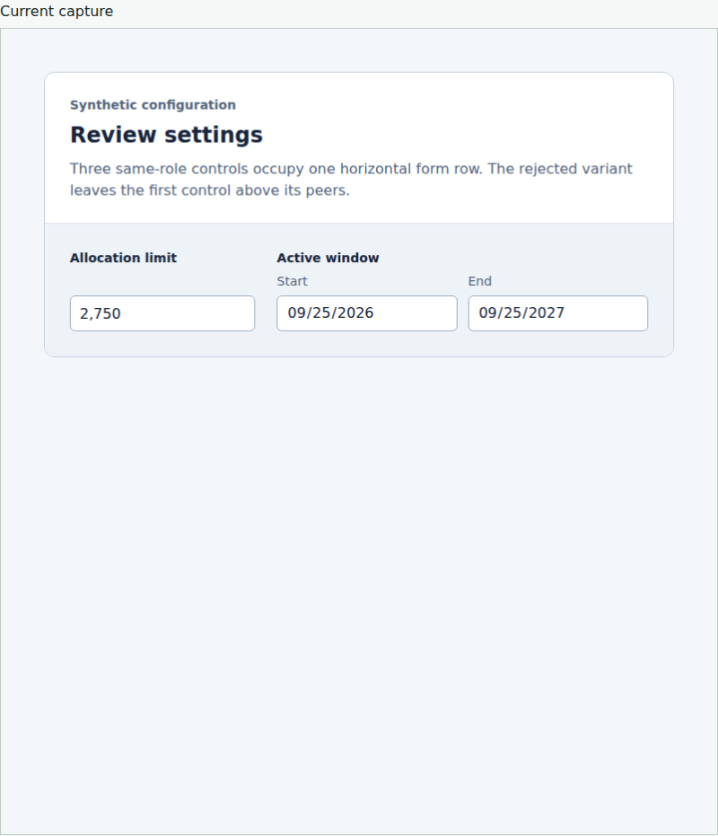
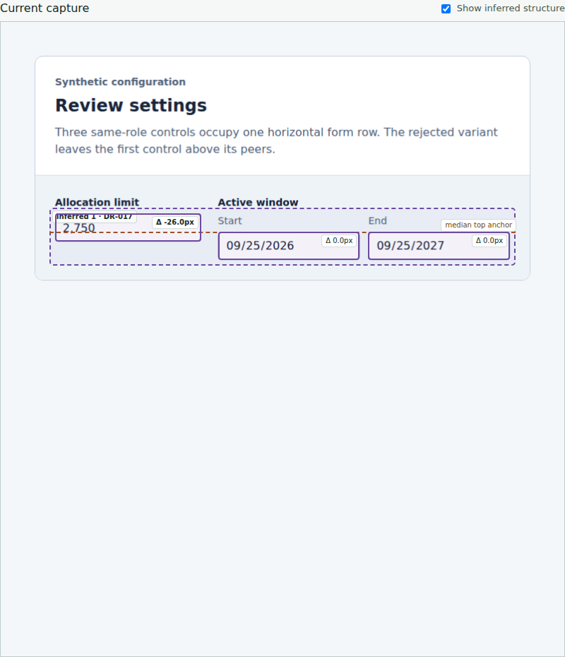

# Peer inference review evidence

Viewrule infers a likely same-row control relationship without an authored
selector. The aligned form yields no candidate; removing only the first field's
reserved sublabel slot produces one advisory DR-017 candidate with a 26 CSS px
residual. Both forms have zero configured findings and exit successfully.

The report draws the saved member boxes, median guide, and signed offsets over
the unchanged capture. The toggle hides the overlay and the capture link still
opens the original PNG. The overflowing reproduction retains its independent
`page-overflow` error while its overlay uses full-page capture dimensions.

The existing shared composition scenario exposed two report bugs before repair:
outline borders enlarged the measured boxes, and viewport-width scaling shifted
members on an overflowing PNG. It now checks actual browser bounds against saved
coordinates, verifies the toggle, and exports these separate report images:

| Aligned controls | Misaligned controls with inference |
| --- | --- |
|  |  |

[Original misaligned capture in its report](peer-original.png) ·
[Overflow capture with correctly scaled overlay](peer-overflow-overlay.png)

`evidence.tar.gz` preserves both raw reports, original PNGs, tiles, and the fixture
and report source. `provenance.json` records hashes, source identity, browser,
observations, and validation. Local captures use Chromium 153.0.8010.0 because the
pinned browser download failed; the PR separately links pinned Chromium CI results.
These are synthetic regressions and review evidence, not human-approved examples
or proof of general alignment detection or design quality. Inference remains
advisory and cannot change an exit code or establish design-policy coverage.
