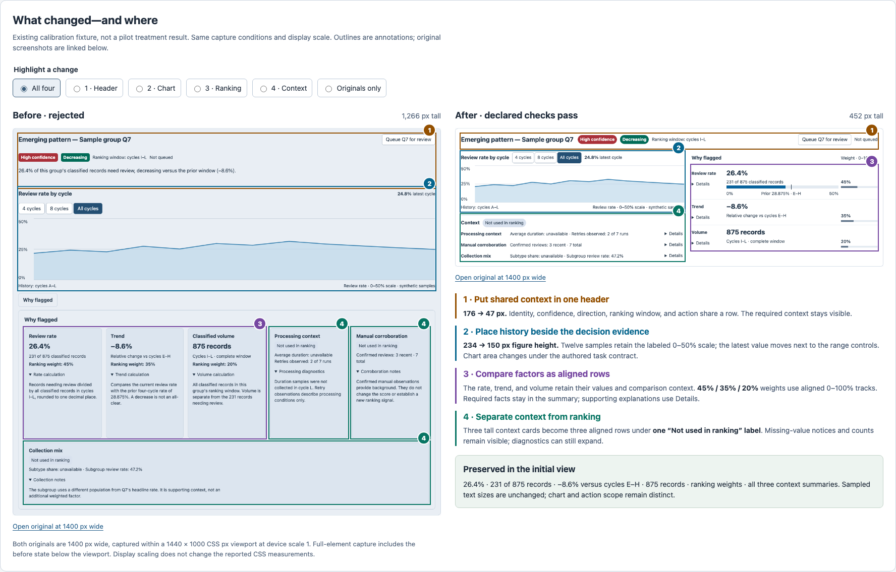
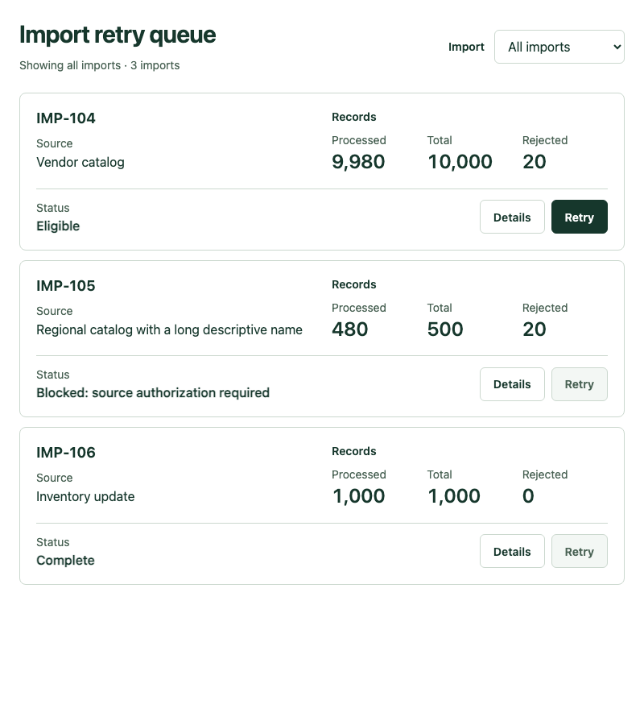
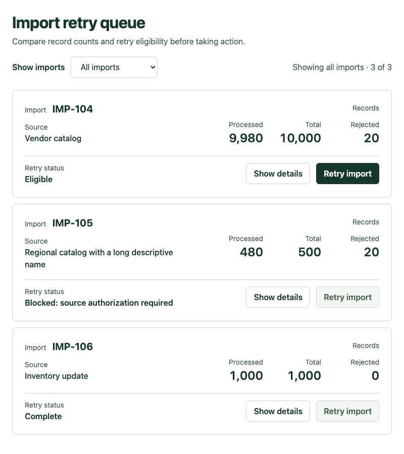
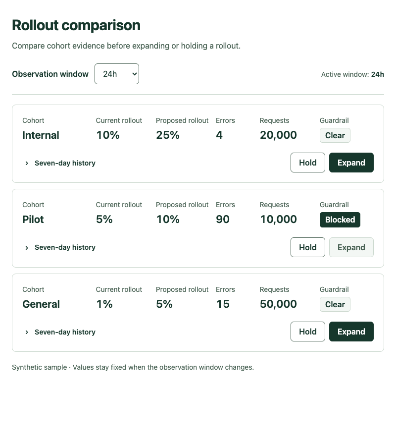
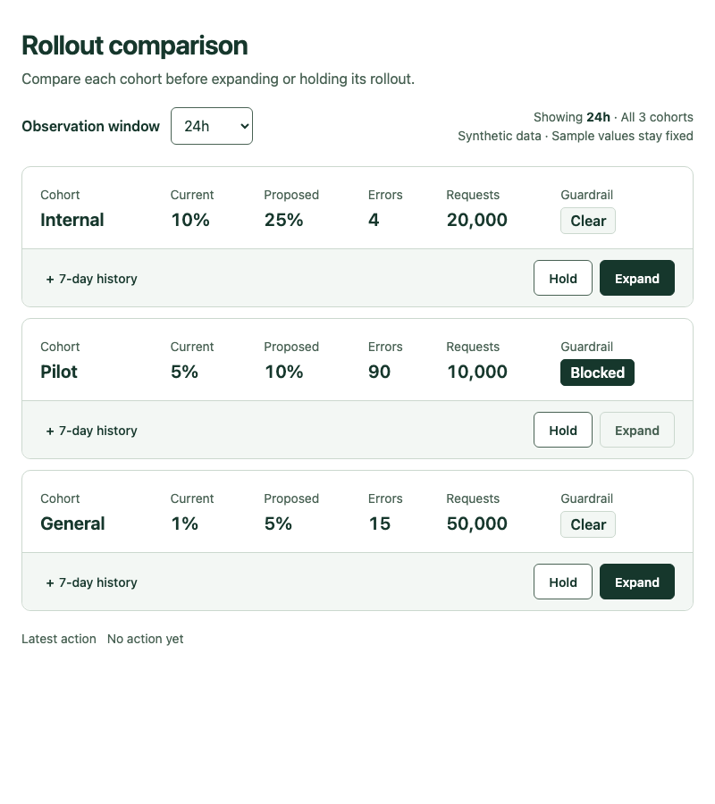

# Saved before and after — 24 September 2026

## Start with the richer composition case

The pilot pairs below have **no intended visual change**: three retained identical
HTML, and the fourth removed an unused CSS declaration. They are an audit trail,
not evidence of a visible transformation. The tasks were too simple to separate
the workflows on the measured requirements.

For an inspectable composition change, use the existing pattern-review case: twelve
history samples, three weighted ranking factors, three context groups, six
disclosures, and one scoped action. The annotated comparison identifies the header,
chart, ranking, and context changes, with the preserved facts beside them.

[Open the full-size annotated comparison](composition-review-2026-09-24/annotated-comparison.png)
· [Interactive annotation viewer](composition-review-2026-09-24/index.html)
· [Original before](composition-review-2026-09-24/before.png)
· [Original after](composition-review-2026-09-24/composition.png)

The viewer lets you highlight one change or hide annotations. It also includes
the **component-only intermediate state**, which still fails the composition
requirements, and the **compact hidden-evidence control**, which fails despite
being the same height as the accepted composition. Serve the repository locally
to use the HTML viewer; GitHub shows its source. Images and this page open directly.

Measured total height is 1,266 → 1,067 → 452 CSS px across before, component-only,
and composition states. Required facts and sampled text sizes remain unchanged.
This is an **existing authored calibration case**, not a new agent trial or an
effect attributable to the short preflight. See the [measurement record and limits](pattern-review-results.md)
and [retained provenance](composition-review-2026-09-24/provenance.json).

## Original pilot record

These are matching initial-state captures of the **first checked implementation**
and **final implementation** within each session. They do not imply a defect was
repaired: unchanged output remains unchanged. Baseline and treatment are separate
fresh sessions, not successive edits to the same application.

See the [pilot report](prevention-pilot-2026-09-24.md) for outcomes and limitations.
The [evidence archive](prevention-evidence-2026-09-24.tar.gz) retains both HTML sources,
reports, interaction records, frozen inputs, and the old/new workflow guidance.
Images below use 800×900 CSS px; linked wide captures use 1280×900. Open an image to
inspect it at original size. All data is synthetic.

Guidance: [released review workflow](https://github.com/lanej/viewrule/blob/0b1073a15cb46f598a7a38dc6c3c92bc00910f81/plugins/claude-code/skills/review/SKILL.md)
→ [revised review workflow](../../plugins/claude-code/skills/review/SKILL.md), starting
with the [short preflight](../../plugins/claude-code/skills/review/preflight.md).

## Import queue — baseline

**Visual change: none.** First checked and final HTML are identical.

| First checked | Final |
| --- | --- |
|  |  |

Wide: [first checked](prevention-captures-2026-09-24/imports-baseline-first-1280.png) · [final](prevention-captures-2026-09-24/imports-baseline-final-1280.png).

## Import queue — treatment

**Visual change: none intended.** The sole source change removes an unused malformed
CSS declaration; measured task outcomes remain unchanged.

| First checked | Final |
| --- | --- |
|  |  |

Wide: [first checked](prevention-captures-2026-09-24/imports-treatment-first-1280.png) · [final](prevention-captures-2026-09-24/imports-treatment-final-1280.png).

## Rollout comparison — baseline

**Visual change: none.** First checked and final HTML are identical.

| First checked | Final |
| --- | --- |
|  |  |

Wide: [first checked](prevention-captures-2026-09-24/rollout-baseline-first-1280.png) · [final](prevention-captures-2026-09-24/rollout-baseline-final-1280.png).

## Rollout comparison — treatment

**Visual change: none.** First checked and final HTML are identical.

| First checked | Final |
| --- | --- |
|  |  |

Wide: [first checked](prevention-captures-2026-09-24/rollout-treatment-first-1280.png) · [final](prevention-captures-2026-09-24/rollout-treatment-final-1280.png).
