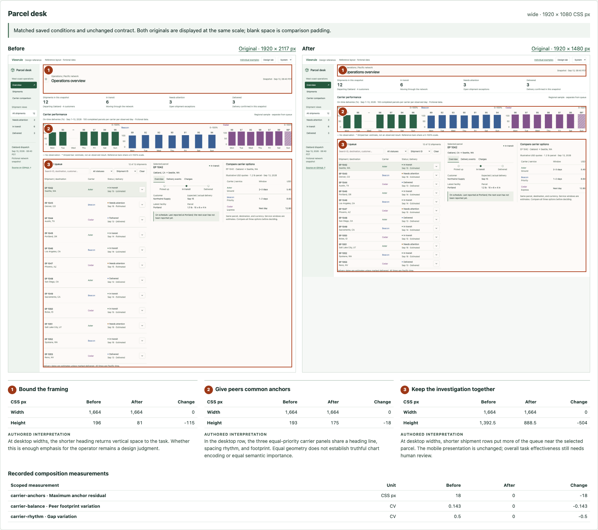

# Parcel desk: generated saved-review comparison

This is the output of the installed `viewrule compare` command over two saved
reviews of the complete Parcel desk application. The [protocol](../saved-comparison-protocol.md)
fixed acceptance before the deliberate presentation override was removed. No data,
thresholds, or application behavior changed. This is a synthetic repair/report
calibration, not a fresh agent generation trial or evidence of prevention efficacy.

The 1440px and 1920px views reject the before heading, carrier anchor, gap, and
footprint conditions, then pass under the identical contract. The heading changes
from 196 to 81 CSS px; carrier heading residual falls from 18 to 0 CSS px and gap
variation from .5 to 0. The mobile originals are byte-identical and explicitly
labeled unchanged. Smaller geometry is not a general quality score.

The [evidence archive](evidence.tar.gz) retains the portable HTML comparison,
all three annotated image exports, exact before/after JSON and original PNG bytes,
full-resolution tiles, both application source revisions, authored commentary,
fixed protocol, application interaction validation, and provenance. Extract it and
open `comparison/index.html`; no server or model is needed. The native checkbox
hides annotations, and the original captures remain directly accessible.
[SHA-256](evidence.tar.gz.sha256) and [source/package provenance](provenance.json)
identify the retained files. Input report/PNG hashes were checked against archived
bytes. Raw reports retain local temporary capture paths; no authentication state
was used. Archives are evidence, not an installed engine release.

Application assertions preserve all twelve shipment identities, three chart
series/domains and samples, shared context, and readable supporting type. Both
revisions exercise search/clear, attention filtering, selection, keyboard
expansion, tab selection, and URL restoration. Manual visual inspection covered
the desktop/wide comparison and unchanged mobile presentation. The local run uses
Chromium 151.0.7922.34 through `VIEWRULE_BROWSER_PATH`; it is not a cross-browser
compatibility claim. Task relevance, chart semantics, overall quality, and actual
operator effectiveness still require human review. No human approval is recorded.

See [command usage and measurement limits](../../../docs/saved-comparisons.md).
Regenerate current evidence through the existing installed workflow (`npm test`);
CI preserves its full output, including negative comparison cases, separately.
