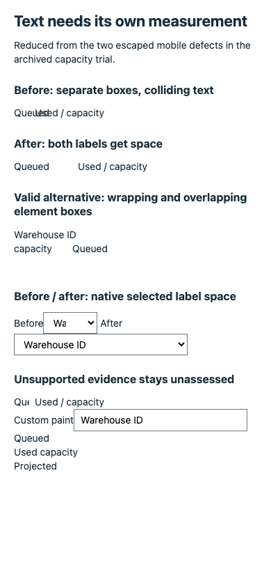
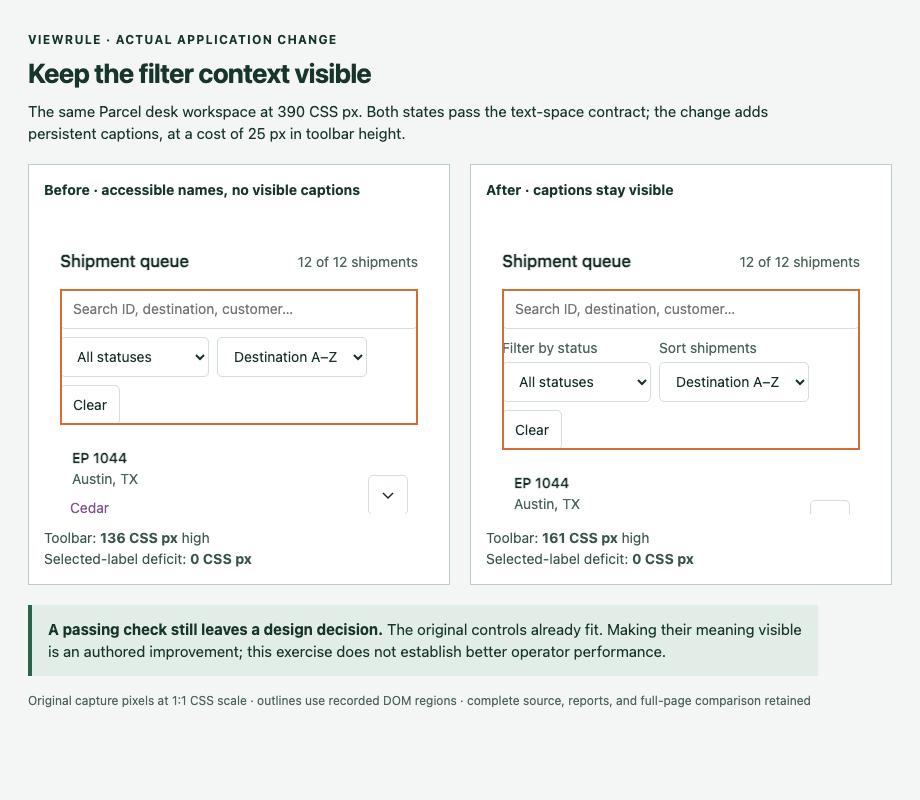

# Scoped text legibility — September 25, 2026

The [new contracts](../../../docs/text-legibility.md) detect the two mobile text
defects found in the archived capacity trial. They remain opt-in and task scoped.

| Original trial source | First state under new rules | Repaired state |
| --- | --- | --- |
| Baseline row labels | 12 intersecting fragment pairs across 6 affected rows | No intersections |
| Preflight sort control | 149 px intrinsic width requested; 78.25 px available | 254.734375 px available; no deficit |

These are calibration results, not independent evidence of prevention effectiveness.
Historical reports and scores were not changed. Text rectangles and intrinsic
control width are proxies; unsupported evidence remains unassessed. The installed
regression also accepts repaired and wrapped labels while rejecting unsupported
clipping, generated content, and custom-control paint as unassessed.

## Passing application change

Parcel desk now keeps status and sort captions visible. The previous native
controls already fit: both states pass the same text contract. The toolbar grows
from 136 to 161 CSS px. Sorting, filtering, selection, keyboard disclosure, detail
tabs, and URL restoration remain exercised; usefulness is still a human judgment.

[Download complete evidence](evidence.tar.gz), with first/final source, raw reports,
original PNGs, annotated comparison, close-up HTML, original trial-source replay,
and a file-hash manifest. Archive SHA-256: `0fb42dee07e16b3250ef15b2a98a61621f57ba3464ff5e82842883772978a8c4`.
Every archived byte was read back and matched to its source.

Engine source: [`6de01a8`](https://github.com/lanej/viewrule/commit/6de01a87ecd944e73b413d8725b91f0f9e41d43a).
[Provenance](provenance.json) identifies the exact tested development archive and
browser. This is not a new release or a model-cost comparison. See the
[fixed application protocol](../text-legibility-protocol.md) for scope and limits.
