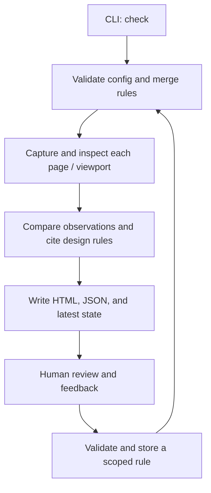

# Architecture

Viewrule is a local Node CLI orchestrating a Chromium browser process. The CLI is
the supported integration boundary; `src/` modules are internal. There is no daemon,
database service, model dependency, or general plugin framework in 0.3.
Coding agents are the primary operators; humans supply intent and review judgments.
The Claude Code plugin is a client of this boundary, using Claude's model to interpret
rules and evidence while the engine performs deterministic checks.

## Ownership

| Location | Owns | Does not own |
| --- | --- | --- |
| Viewrule repository | Engine, rule schema, design policy, reports, distribution, regression detector | Personal taste or application code |
| `plugins/claude-code/` | Setup/review/feedback skills, pinned engine installation, legacy Stop migration | Measurement logic, model self-approval, application source repair logic |
| Dotfiles | Installation choices, development-checkout override, personal preferences, legacy Stop-hook migration | A second copy of the engine |
| Application `.ui-review/` | Routes, selectors, viewports, thresholds, recorded feedback, approved references | Global defaults for unrelated applications |

Global configuration defaults to `$XDG_CONFIG_HOME/viewrule`, or `~/.config/viewrule`.
`VIEWRULE_CONFIG_DIR` overrides it; legacy `UI_REVIEW_GLOBAL_DIR` is also accepted.
Project rules override global rules by exact rule ID. No per-user data is written
inside the installed package.

## Source diagnostics

`lint` runs Impeccable through its pinned installed native CLI and JSON interface.
The package dependency supplies the platform engine; checks do not download or
install tools. New projects include an advisory built-in source provider, while
existing command adapters and application contracts remain unchanged.

`src/impeccable.mjs` resolves and identifies the installed detector.
`src/source-checks.mjs` executes and normalizes providers with shared authority
rules for `lint` and `check`. The quick command returns source-only JSON and never
writes `.ui-review/latest.json`; authored rendered requirements still require the
browser workflow. See [configuration and limits](impeccable.md).

## Runtime path

The source fingerprint is computed before and after capture. Changing scoped
source or rules during a run fails that run. Each page/viewport receives a fresh
Chromium context, deterministic capture settings, an overview, and overlapping
detail tiles. Measurements use browser CSS coordinates, not a resized screenshot.

DOM observations feed cross-viewport comparisons. Findings then receive policy
citations and remediation suggestions. The report embeds the design-policy text
and its hash so an old finding can be read against the policy it used.

## Modules

Built-in opinion lives in `presets/preferences.json`; `src/presets.mjs` loads it for
guidance and reports. Initialization copies baseline or analytical rules into the
application's editable rules file. Existing rules are never silently replaced.
Preset assets are packaged with the engine and included in freshness fingerprints.

The self-contained Claude plugin is discovered through the root marketplace manifest.
Its Node launcher downloads the exact `engine.json` archive, checks SHA-256 before
installation, and uses a version/checksum directory outside the plugin cache.
Downloads require explicit setup or browser installation. Retired Stop registrations return immediately, even before engine setup. The `docs`
adapter command points skills at the matching installed policy and rule reference.
Plugin cache files are immutable during setup; no parent-repository paths are needed.

| Module | Responsibility |
| --- | --- |
| `src/presets.mjs`, `presets/` | Built-in guidance and validated editable starter rules |
| `plugins/claude-code/scripts/viewrule.mjs` | Pinned installation, CLI delegation, documentation paths, retired Stop compatibility |
| `plugins/claude-code/scripts/migrate-stop.mjs` | Setup-time migration of known Viewrule Stop handlers in user and project settings |
| `bin/viewrule.mjs` | Executable, retired Stop compatibility, version, browser installation |
| `src/cli.mjs` | Command parsing and presentation |
| `src/git-gate.mjs` | Optional staged/pushed input selection and comparison with reviewed working files |
| `src/paths.mjs`, `plugins/claude-code/scripts/project.mjs` | User-config location, compatibility environment variables, and dependency-free project discovery shared with the isolated plugin |
| `src/contract.mjs` | Effective pre-design boundaries, canonical hashes, snapshots, and report-to-report changes |
| `src/changes.mjs` | Finding identities and approved-review deltas, including unassessed or incomparable evidence |
| `src/scopes.mjs`, `src/source-scope.mjs`, `src/plan.mjs` | Shared selection, conservative input resolution, and read-only workload plans |
| `src/config.mjs` | Ajv validation, project loading, defaults, rule merging |
| `src/review.mjs` | Browser lifecycle and review orchestration |
| `src/capture.mjs` | Native-scale tile planning, capture, and coverage accounting |
| `src/comparison.mjs` | Explicit saved-run comparison, original artifact preservation, recorded-region callouts, and optional report image export |
| `src/checks.mjs` | Browser-side DOM geometry and style observations |
| `src/design.mjs` | Design policy loading, cross-viewport rules, citations, suggestions |
| `src/report.mjs`, `src/templates/` | Report view models and escaped Mustache HTML reports/policy pages |
| `src/types.d.ts` | Internal contracts for JavaScript static analysis; no emitted code |
| `src/state.mjs` | Fingerprints, atomic state writes, feedback, learning, evidence verification |

Report markup lives in packaged HTML templates. Mustache escapes interpolated values;
the policy body alone uses pre-escaped text with fixed paragraph/emphasis tags.
Template contents and paths participate in freshness fingerprints. The fixture HTML shell lives in `test/templates/`; React components and CSS live
in `test/react/` and are bundled for the temporary fixture app. React/esbuild are
development dependencies only. The demo uses the same fixtures.

Rule definitions are data, not executable user JavaScript. Adding a measurement
means extending its schema, observation/evaluation, policy mapping, and docs in one
change. Do not add a generic extension API before a concrete integration needs one.

## Versioned design guidance

Canonical Markdown lives in `plugins/claude-code/guide/v1/` so Claude's isolated
plugin cache has offline guidance before engine setup. The npm package includes
that same tree and its dependency-free reader. `guide [ID]` runs without a project,
browser, or configured engine; existing `guidance` retains its preference behavior.
The index reports stable IDs, summaries, applicability, related rules, and evidence.

The build-only `marked` dependency renders the guide through the existing Mustache
convention. `scripts/guide.mjs` checks its JSON-frontmatter contract, references, and
examples before Pages rendering; the exported `.md` pages rewrite body and example-metadata links for direct public retrieval. The build validates their targets and anchors. Local/package Markdown remains canonical.
Canonical runnable examples live in Easy UI’s existing Storybook/gallery. The maintenance
command `examples:import` imports a clean commit’s static guide build into the existing
`docs/examples/` routes, including local fonts and redistribution notices. The guide’s
`examples.json` records source revision and checksums. Normal checks/builds validate
the bundled assets offline; the installed workflow verifies client-rendered anchors
and specific findings. React remains an example build dependency, not a CLI dependency.
No runtime retrieval service, alternate app, or additional automated design rule is
introduced. Advice cannot establish which decision factors the task requires.

## Stored state

| File | Lifecycle |
| --- | --- |
| `.ui-review/config.json` | Versioned project settings; explicit Stop opt-in |
| `.ui-review/rules.json` | Scoped executable expectations |
| `.ui-review/feedback.jsonl` | Append-only human feedback and provenance |
| `.ui-review/approved/<id>/` | Exact report and screenshots approved by a human |
| `.ui-review/runs/<id>/` | Disposable run: JSON, HTML, policy snapshot, overview, tiles |
| `.ui-review/latest.json` | Running/pass/fail state and source fingerprint for verification |
| Global `rules.json`, `preferences.json`, `feedback.jsonl` | Deliberately reusable rules and notes |

Global feedback does not copy project screenshots; prose can still contain private
information. Rules are updated using an exclusive lock and atomic rename. Runs
have unique directories; concurrent checks of one project are not a supported
workflow. A process interrupted after setting `running` leaves enforcement blocked
until a successful rerun.

Git worktrees carry committed setup independently and keep mutable evidence in each
application directory. Project discovery stops at either form of `.git` marker;
the shared Git metadata directory never supplies application configuration. See
[worktree setup and isolation](worktrees.md).

## Confidence and enforcement boundaries

Geometry can establish an edge position or visible box count with high confidence
within the DOM model. It cannot establish task relevance, unobstructed visibility
in every case, chart truth, or visual quality. Canvas, ancestor clipping, occlusion,
and semantic metadata require additional review. Density remains a proxy.

`verify` reads state and compares fingerprints without launching a browser. The
optional Git gates in `src/git-gate.mjs` select affected application inputs, compare
the relevant working bytes with the index or outgoing commit tree, and then call the
same verifier. They preserve the index and working files. Stop registration is
removed; old `hook` commands return `{}` without requiring an installed engine.
Use application CI and repository branch protection when a passing review must gate
merging. Viewrule supplies the exit code; repository owners configure the required
status check. See [Git gates and migration](git-gates.md).

Fingerprints cover configured source and runtime setup, local/global rules and preferences, engine
files, package manifest, shrinkwrap, and design policy. They do not cover changing
remote data, browser binaries, operating-system fonts, or a modified live server.
Recheck after those change. A fingerprint is a freshness aid, not an attestation.

## Incremental execution

Opt-in `reviewScopes` connect file/document inputs to configured browser states and
source providers through explicit dependencies. `review-scopes.mjs` validates the
graph; `incremental.mjs` compiles affected obligations and verifies/copies reusable
evidence; `fingerprints.mjs` centralizes file and engine identities. The runner
always aggregates every required obligation and recomputes cross-state rules.
Legacy `check` remains full; see [validity, provenance, and limits](incremental-review.md).

For scoped reviews only, freshness also covers browser/provider binaries, runtime
setup files, an explicit environment identity, evidence integrity, and bounded age.
Remote data and OS fonts are not automatically observed; the operator must update
the nonsecret environment key or force a full review when they change.
