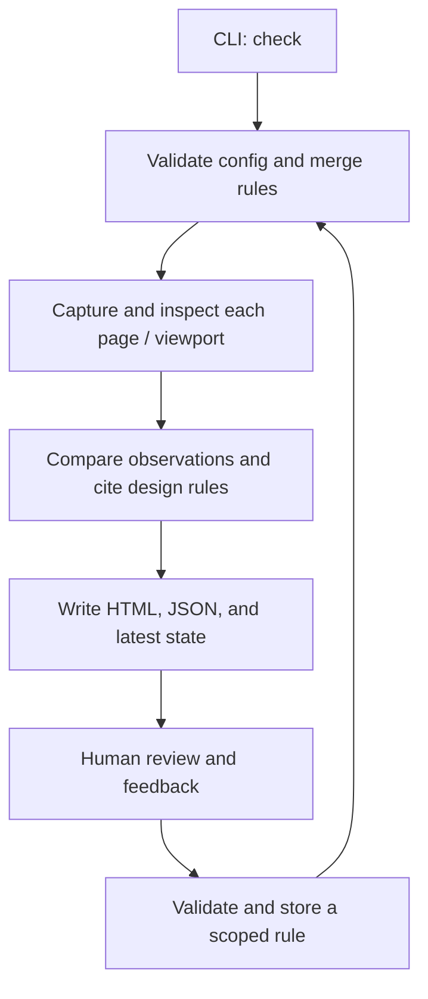

# Architecture

Viewrule is a local Node CLI orchestrating a Chromium browser process. The CLI is
the supported integration boundary; `src/` modules are internal. There is no daemon,
database service, model dependency, or general plugin framework in 0.2.
Coding agents are the primary operators; humans supply intent and review judgments.
The Claude Code plugin is a client of this boundary, using Claude's model to interpret
rules and evidence while the engine performs deterministic checks.

## Ownership

| Location | Owns | Does not own |
| --- | --- | --- |
| Viewrule repository | Engine, rule schema, design policy, reports, distribution, regression detector | Personal taste or application code |
| `plugins/claude-code/` | Setup/review/feedback skills, pinned engine installation, Stop adapter | Measurement logic, model self-approval, application source repair logic |
| Dotfiles | Installation choices, development-checkout override, personal preferences, optional legacy hook | A second copy of the engine |
| Application `.ui-review/` | Routes, selectors, viewports, thresholds, recorded feedback, approved references | Global defaults for unrelated applications |

Global configuration defaults to `$XDG_CONFIG_HOME/viewrule`, or `~/.config/viewrule`.
`VIEWRULE_CONFIG_DIR` overrides it; legacy `UI_REVIEW_GLOBAL_DIR` is also accepted.
Project rules override global rules by exact rule ID. No per-user data is written
inside the installed package.

## Runtime path

The source fingerprint is computed before and after capture. Changing scoped
source or rules during a run fails that run. Each page/viewport receives a fresh
Chromium context, deterministic capture settings, an overview, and overlapping
detail tiles. Measurements use browser CSS coordinates, not a resized screenshot.

DOM observations feed cross-viewport comparisons. Findings then receive policy
citations and remediation suggestions. The report embeds the design-policy text
and its hash so an old finding can be read against the policy it used.

## Modules

Built-in opinion lives in `presets/preferences.json`; `src/presets.mjs` loads it for
guidance and reports. Initialization copies baseline or analytical rules into the
application's editable rules file. Existing rules are never silently replaced.
Preset assets are packaged with the engine and included in freshness fingerprints.

The self-contained Claude plugin is discovered through the root marketplace manifest.
Its Node launcher downloads the exact `engine.json` archive, checks SHA-256 before
installation, and uses a version/checksum directory outside the plugin cache.
Downloads require explicit setup or browser installation. The hook has a preflight for unconfigured
projects and then delegates freshness checks to the installed engine. The `docs`
adapter command points skills at the matching installed policy and rule reference.
Plugin cache files are immutable during setup; no parent-repository paths are needed.

| Module | Responsibility |
| --- | --- |
| `src/presets.mjs`, `presets/` | Built-in guidance and validated editable starter rules |
| `plugins/claude-code/scripts/viewrule.mjs` | Pinned installation, CLI delegation, documentation paths, missing-engine hook handling |
| `bin/viewrule.mjs` | Executable, lightweight hook preflight, version, browser installation |
| `src/cli.mjs` | Command parsing and presentation |
| `src/paths.mjs` | User-config location and compatibility environment variables |
| `src/contract.mjs` | Effective pre-design boundaries, canonical hashes, snapshots, and report-to-report changes |
| `src/config.mjs` | Ajv validation, project loading, defaults, rule merging |
| `src/review.mjs` | Browser lifecycle and review orchestration |
| `src/capture.mjs` | Native-scale tile planning, capture, and coverage accounting |
| `src/checks.mjs` | Browser-side DOM geometry and style observations |
| `src/design.mjs` | Design policy loading, cross-viewport rules, citations, suggestions |
| `src/report.mjs`, `src/templates/` | Report view models and escaped Mustache HTML reports/policy pages |
| `src/types.d.ts` | Internal contracts for JavaScript static analysis; no emitted code |
| `src/state.mjs` | Fingerprints, atomic state writes, feedback, learning, Stop decisions |

Report markup lives in packaged HTML templates. Mustache escapes interpolated values;
the policy body alone uses pre-escaped text with fixed paragraph/emphasis tags.
Template contents and paths participate in freshness fingerprints. The fixture HTML shell lives in `test/templates/`; React components and CSS live
in `test/react/` and are bundled for the temporary fixture app. React/esbuild are
development dependencies only. The demo uses the same fixtures.

Rule definitions are data, not executable user JavaScript. Adding a measurement
means extending its schema, observation/evaluation, policy mapping, and docs in one
change. Do not add a generic extension API before a concrete integration needs one.

## Stored state

| File | Lifecycle |
| --- | --- |
| `.ui-review/config.json` | Versioned project settings; explicit Stop opt-in |
| `.ui-review/rules.json` | Scoped executable expectations |
| `.ui-review/feedback.jsonl` | Append-only human feedback and provenance |
| `.ui-review/approved/<id>/` | Exact report and screenshots approved by a human |
| `.ui-review/runs/<id>/` | Disposable run: JSON, HTML, policy snapshot, overview, tiles |
| `.ui-review/latest.json` | Running/pass/fail state and source fingerprint for the hook |
| Global `rules.json`, `preferences.json`, `feedback.jsonl` | Deliberately reusable rules and notes |

Global feedback does not copy project screenshots; prose can still contain private
information. Rules are updated using an exclusive lock and atomic rename. Runs
have unique directories; concurrent checks of one project are not a supported
workflow. A process interrupted after setting `running` leaves enforcement blocked
until a successful rerun.

## Confidence and enforcement boundaries

Geometry can establish an edge position or visible box count with high confidence
within the DOM model. It cannot establish task relevance, unobstructed visibility
in every case, chart truth, or visual quality. Canvas, ancestor clipping, occlusion,
and semantic metadata require additional review. Density remains a proxy.

The Stop hook reads state and compares fingerprints; it does not launch a browser.
Its continuation guard permits a subsequent stop to avoid loops. Use application
CI and repository branch protection when a passing check must gate a merge.
Viewrule supplies the exit code; repository owners configure required status checks.

Fingerprints cover configured source, local/global rules and preferences, engine
files, package manifest, shrinkwrap, and design policy. They do not cover changing
remote data, browser binaries, operating-system fonts, or a modified live server.
Recheck after those change. A fingerprint is a freshness aid, not an attestation.
