# Good and bad examples

For a complete connected workflow, see [the mock application](mock-application.md):
navigation, charts, search, filters, drawers, tabs, and carrier comparisons together.

The gallery now also links [synthetic pricing action lists](examples/pricing.html)
and [encoding comparisons](examples/encodings.html). Their task, cited guidance,
assumptions, and scoped expected findings are explained in the
[design guide](../plugins/claude-code/guide/v1/index.md). The sparse and overloaded
pricing examples are advisory counterexamples that pass the supplied clipping rule.
Use `npm run site:preview` for working guide links in these new examples.

Each pair keeps the content and task constant. Component pairs change one design
property; the analytical decision-surface pair combines several related lessons.
“Good” means that property satisfies the stated expectation; it does not approve
the entire interface or establish that every Viewrule check passes.

Open [the interactive gallery](examples/index.html) from a local checkout in your
browser. It needs no server, build, installation, or network connection. GitHub's
file browser shows the HTML source; the screenshots below are viewable on GitHub.
The gallery follows your operating system's light/dark preference. Resize the browser
to inspect the actual layout. Drawers, tabs, and navigation stay synchronized across
both sides. The example selector and URL fragment link to individual pairs.
Full workspaces are stacked vertically so their text stays at native size. They
reflow into a single column on narrow screens rather than shrinking a desktop image.
The workspace screenshots use a 960 CSS px browser width and device scale 1. They
capture the full examples; their height does not imply everything fits above the fold.

The labels report local geometry and simple solid-color contrast calculations.
They are teaching aids, not Viewrule findings: the gallery does not run the engine
or axe. Use [the detection manual](ui-review.md) for real application assessment.

| Example | Design rule | Detection available in Viewrule |
| --- | --- | --- |
| [Component relationships](component-relationships.md#rejected-and-passing-examples) | DR-005/006/007: continuity, grouping, legibility | Installed-engine fixture for per-item graphics, relative placement, readable spacing and list-to-detail SVG continuity; grid and flex satisfy the same contract |
| [Expandable list](#expandable-list) | DR-008: framing earns its space | `max-height`, with a project-specific selector and limit |
| [Text with a diagram](#text-with-a-diagram) | DR-007: preserve legibility | Built-in `axe:color-contrast` when accessibility is enabled |
| [Tab bar](#tab-bar) | DR-006: keep identifying labels readable | `no-clip` scoped to the tab buttons |
| [Hamburger menu](#hamburger-menu) | DR-007: preserve usable controls | Baseline `min-size` warning below 24×24 CSS px |
| [Hamburger workspace](#hamburger-workspace) | DR-006: keep task context available | Project `no-overlap` check on the open navigation and workspace |
| [Sidebar workspace](#sidebar-workspace) | DR-008: framing earns its space | Project `max-height` check on the workspace banner at desktop widths |
| [Numeric alignment](#numeric-alignment) | DR-006: align related values | Analytical `style` rule for declared numeric amounts |
| [Comparison spacing](#comparison-spacing) | DR-007: extra width preserves useful detail | Analytical `max-text-gap` rule for declared comparison rows |

## Expandable list

[Interactive example](examples/index.html#drawers) ·
[DR-008](design-rules.md#dr-008--decoration-earns-its-space-and-visual-weight)

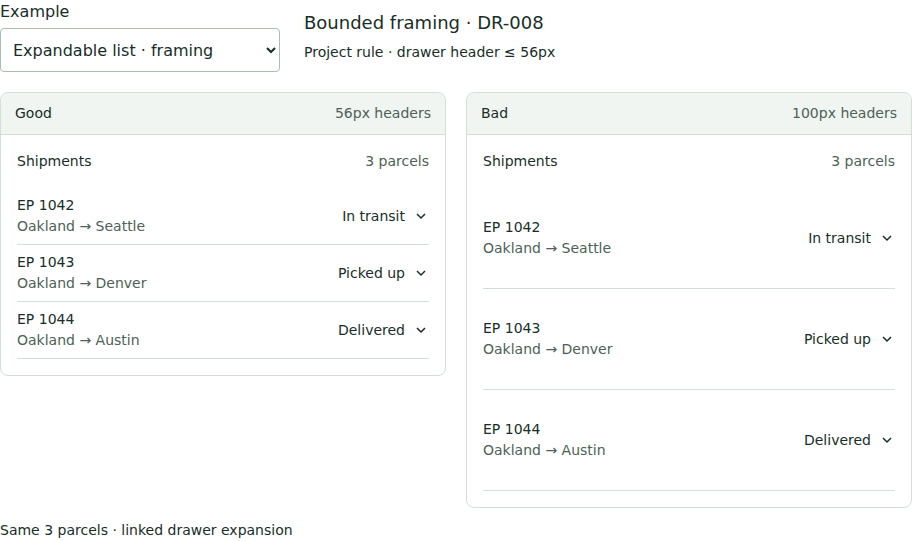

The 100px headers spend substantially more vertical space showing the same parcel,
route, and status. The 56px headers preserve those labels and the expansion affordance.
Open a drawer on either side to reveal the same secondary shipment details.

The **56px limit is an example project constraint**, not a shipped default or a
universal Tufte rule. `max-height` can enforce it on a declared group of headers.
Calibrate the limit to required content, readable type, and the interaction target.

## Text with a diagram

[Interactive example](examples/index.html#diagram) ·
[DR-007](design-rules.md#dr-007--larger-screens-expose-useful-detail-and-preserve-legibility)

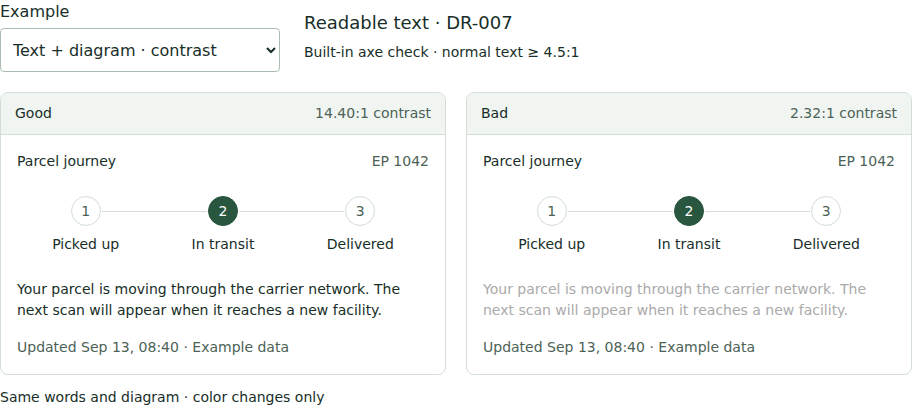

Only the prose color changes. In the light theme, `#aaa` on white produces about
2.32:1 contrast, below the 4.5:1 WCAG AA minimum for normal text. The diagram and
content remain the same. Dark mode uses its own colors and recalculates the labels.

Viewrule already delegates detection to axe. Confirmed violations become blocking
`axe:color-contrast` findings when `accessibility` is enabled. The gallery's simple
calculation does not cover image backgrounds, compositing, or all exceptions;
inconclusive axe results require review. See [WCAG contrast guidance](https://www.w3.org/WAI/WCAG22/Understanding/contrast-minimum.html).

## Tab bar

[Interactive example](examples/index.html#tabs) ·
[DR-006](design-rules.md#dr-006--related-evidence-stays-visible-together)

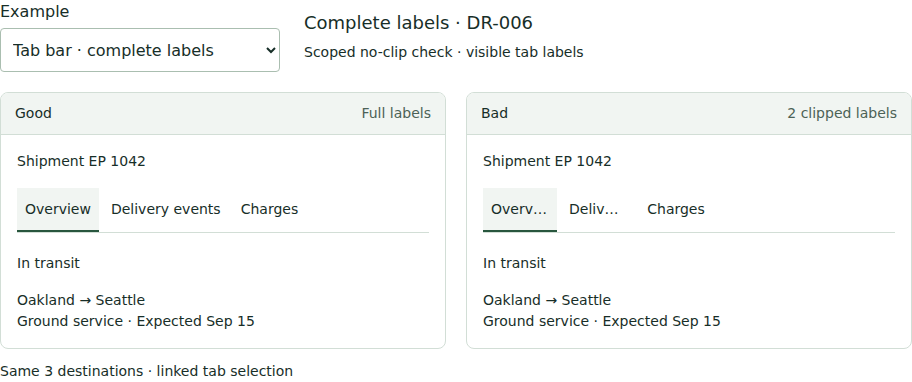

Fixed 74px buttons truncate labels even though the component has room to display
them. The accepted buttons use content-based widths and wrap when necessary.
Click either set or use the arrow keys to compare the same selected panel.

Scope `no-clip` to the tab buttons; Viewrule can detect their clipped contents.
Choosing whether information belongs behind a tab still requires task judgment.
Essential simultaneous comparisons should remain visible together.

## Hamburger menu

[Interactive example](examples/index.html#menu) ·
[DR-007](design-rules.md#dr-007--larger-screens-expose-useful-detail-and-preserve-legibility)

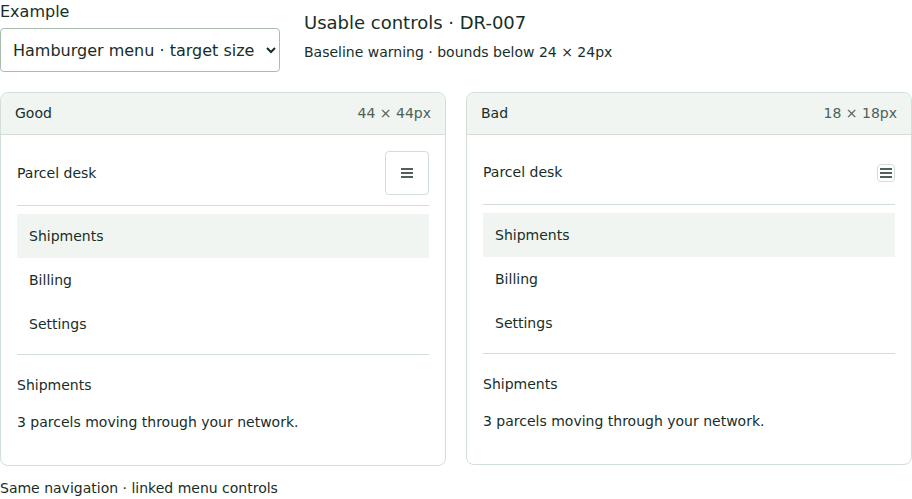

The icon, accessible name, destinations, and behavior are identical. Only the
button bounds change: 44×44px provides a larger target; 18×18px requires greater
precision. Open either menu and choose a destination to change both sides.

The baseline warns on declared ordinary controls below **24×24 CSS px**; 44px is
a deliberate choice in this example, not the engine's minimum. Bounding boxes
do not prove hit geometry or implement every WCAG target-size exception. The
decision to use a hamburger menu also depends on navigation frequency and context.

## Hamburger workspace

[Interactive example](examples/index.html#hamburger) ·
[DR-006](design-rules.md#dr-006--related-evidence-stays-visible-together)

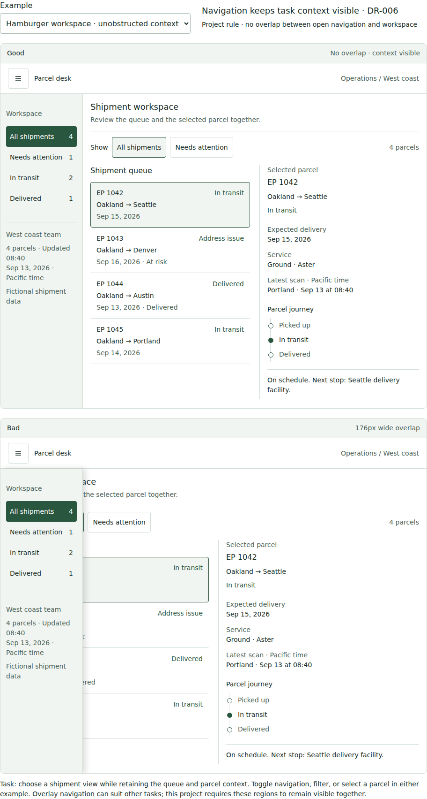

The task is to switch shipment views while retaining the queue and selected parcel
context. Each version includes an application header, four navigation views, filters,
a selectable shipment queue, delivery context, and a parcel journey. The same four
fictional shipments and selection are used in both versions. Try **Needs attention**
to see an address issue, **Delivered** to see a completed journey, or select another
parcel in the queue. The controls update both versions without a network request.

The accepted layout gives the open navigation its own space. The rejected layout
positions the same 176px navigation over the workspace, hiding shipment identities
and controls. The hamburger button opens or closes both drawers; Escape closes them
and returns focus to the button in the example being used. Filtering keeps the
drawer open to make the comparison inspectable.

Scope `no-overlap` to the **two peer regions**: the open navigation and the workspace.
In this gallery they have `data-work-part="navigation"` and `"workspace"`; select
one example's pair, not every descendant or both examples together. The checker
detects intersecting bounding boxes, not the semantic importance of the hidden
content. The gallery label shows the intersection's width; it is not an engine report.
When navigation is closed, neither version demonstrates the defect. Capture the
open state explicitly when assessing the real application.

This is a **task-specific boundary**, not a ban on overlay menus. A temporary overlay
can be appropriate when it is acceptable to leave the current workspace. At narrow
widths the accepted example places navigation above the workspace; absence of overlap
does not establish that every region fits simultaneously in the initial viewport.
That needs its own comparison-set or visible-count expectation and visual review.

## Sidebar workspace

[Interactive example](examples/index.html#sidebar) ·
[DR-008](design-rules.md#dr-008--decoration-earns-its-space-and-visual-weight)

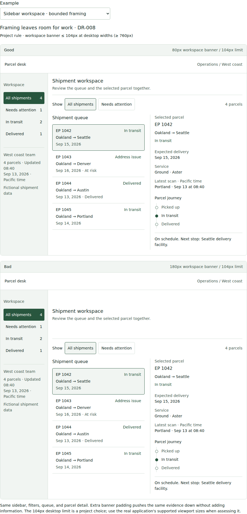

This composition keeps the navigation visible beside the task. Both versions have
the same sidebar, team context, filters, queue, and selected parcel detail. The
sidebar view controls and queue selection work in both versions. On narrow screens
the navigation moves above the queue and detail; text remains at its normal size.

Only the workspace banner's minimum height changes: **80px versus 180px**. The
extra framing pushes the queue and parcel context 100px farther down at the documented
desktop size without adding information. The accepted version retains the heading,
explanation, boundaries, and usable controls. It gains space by reducing padding,
not by shrinking type or deleting content.

An example project can scope `max-height` to `.vr-work-sidebar .vr-work-banner`
within one version, with a **104 CSS px limit** at desktop viewport widths of at least
760px. This allows some content wrapping; it is not a shipped default or a universal
Tufte threshold. The gallery reports the rendered banner height and marks the desktop
limit as inapplicable on smaller screens. Map the rule's `viewports` to the real
application's configured desktop names and calibrate it for its content and language.

This check detects excess header height, not overall information quality or sidebar
width. The gallery is bounded to a documentation reading width; it does not certify
desktop-to-4K behavior. Use the application's actual viewports and native-scale detail
captures to judge how the sidebar and primary comparisons use additional screen area.

## Numeric alignment

[Interactive example](examples/index.html#numbers) ·
[DR-006](design-rules.md#dr-006--related-evidence-stays-visible-together)

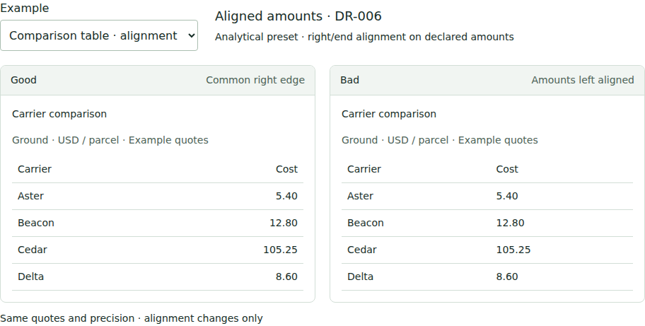

Amounts and their column heading share a right edge in the accepted version.
Both sides retain the same values, currency context, precision, and tabular digits,
so the difference isolates alignment.

The analytical preset applies `text-align: right` or `end` expectations to amounts
explicitly marked with `data-viewrule-number` inside a comparison group. Identifiers
and dates need different treatment; specialized decimal layouts need their own scope.

## Comparison spacing

[Interactive example](examples/index.html#spacing) ·
[DR-007](design-rules.md#dr-007--larger-screens-expose-useful-detail-and-preserve-legibility)

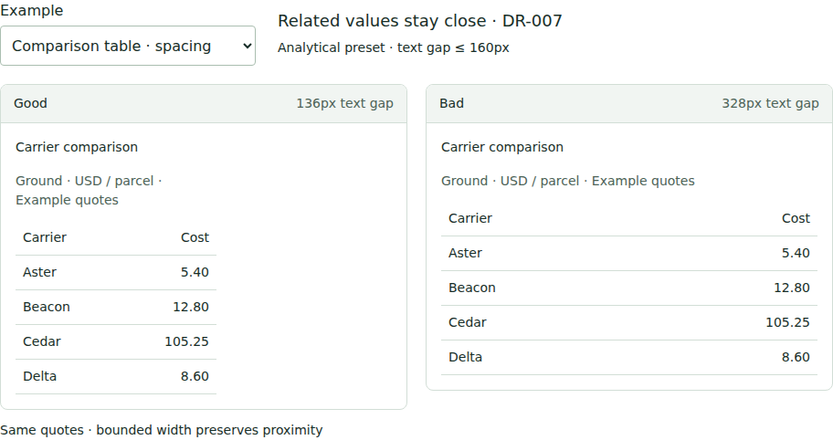

The bounded table keeps each amount near its carrier. Expanding the other table
adds empty distance while preserving exactly the same evidence. Both sides retain
readable text, aligned amounts, and the full set of four quotes.

The analytical preset starts with a maximum **160 CSS px** gap between adjacent
text values in declared comparison cells. The gallery label measures the first row
for illustration; the engine evaluates applicable rows and cells. A bounded table
can leave useful surrounding whitespace. Resize the gallery to observe the gap;
this is not a substitute for measuring your application's supported desktop and 4K states.

## Use and maintain the examples

Read `viewrule contract`, select the relevant expectation, and adapt its selectors
and scope to the actual application. The gallery's illustrative selectors and finite
data sets are not a complete analytical preset configuration. See
[rule authoring](rule-authoring.md) and [the preset defaults](defaults.md).

The gallery lives in `examples/index.html`, `examples/gallery.css`, and
`examples/gallery.js`. Markup uses HTML templates; the script synchronizes state and
updates measurement labels. The two full workspaces share navigation, content, and
row templates, with data written as text rather than generated HTML strings.
All dependencies are local. Format, lint, and static
analysis cover these files through `npm run check`.

When changing an example, preserve identical data and state on both sides, state
the constraint and its scope, inspect the interaction, and refresh its screenshot
at the intended reading size. Click a screenshot to view its original file when
GitHub scales it down. These documentation examples complement the existing
[installed regression workflow](../test/README.md); they do not add a second test suite.

## Interaction and resilience: DR-009–DR-016

[Open the paired behavior examples](examples/behavior.html). Choose a rule, then
exercise the same synthetic task in the good and bad versions. The page links its
sources, alternatives, exceptions, and exact checking boundary; it is not a report
of universal design quality. The [machine-readable catalog](examples/behavior-catalog.json)
uses the same stable DR IDs as the engine policy and is also read by the gallery.

| Rule | Good | Bad | Verification boundary |
| --- | --- | --- | --- |
| DR-009 | Failed refresh retains data with state and separate timestamps | Failure becomes an observed zero | Native scoped context checks; fixture response transitions also exercised |
| DR-010 | Detail return preserves the filter, stable identity, and focus | Returning clears the filter and silently replaces selection | Application interaction assertions, not a generic engine journey check |
| DR-011 | Publication names its selected scope and effect | “Apply” leaves the effect ambiguous | Human action-clarity review; visible scope can be required |
| DR-012 | Rejection preserves the proposal and identifies correction | Rejection clears work and says only “Something went wrong” | Application rejection/correction/undo assertions |
| DR-013 | Exception and response lead the task | A decorative total dominates the exception | Task-scoped human review; no hierarchy score |
| DR-014 | Native disclosure is reachable and operable with the keyboard | Pointer-only text hides essential information from keyboard users | Actual Tab/Enter/Escape fixture sequence; not full accessibility certification |
| DR-015 | Distinguishing suffixes survive wrapping and enlarged text | Identical truncation hides different services | Native `no-clip` on shared long-content fixtures, plus human meaning review |
| DR-016 | Unordered carriers get qualitative colors and labels | A light-to-dark ramp implies a ranking | Human semantic review; no inferred color correctness |

The checks use deliberate fixture data and do not contact carriers or publish
real rates. Good and bad labels describe the stated task, not actual engine output.
Some bad examples intentionally pass unrelated geometry checks.

Run `npm run site:preview` from a checkout and open
`http://127.0.0.1:4173/examples/behavior.html`. All assets and the catalog are local;
no carrier API or external UI runtime is required. `npm test` exercises the same
examples from the packed and installed engine, not a separate test-only copy.
The scoped [configuration](examples/behavior-config.json) and
[rules](examples/behavior-rules.json) are provided for adaptation to a disposable
`.ui-review` project; they intentionally reject the bad context and clipping cases.

### Rendered interaction examples

[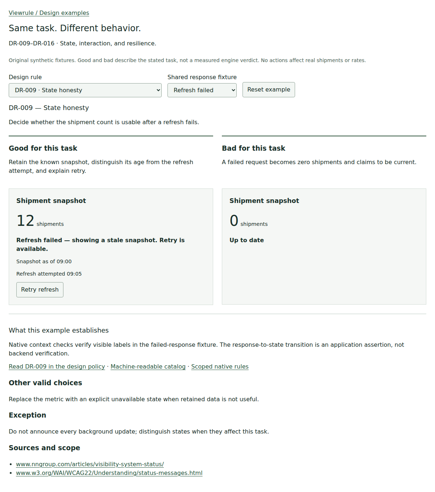](examples/images/behavior/dr-009-failed-refresh.png)

[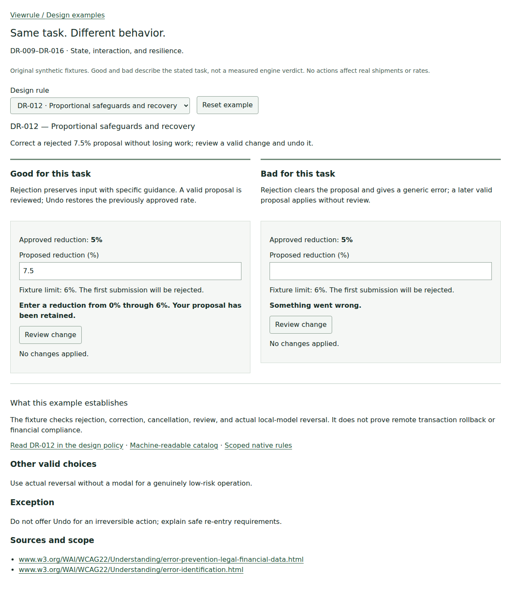](examples/images/behavior/dr-012-rejected.png)

These original captures show both versions at 1200 CSS pixels wide, device scale 1,
light theme; full-page height is not initial-viewport fit. See the
[390px enlarged-text example](examples/images/behavior/dr-015-mobile-enlarged.png)
and [capture metadata](examples/images/behavior/captures.json) for exact state,
viewport, and browser. Enlarged example text is not browser zoom or a complete
accessibility test. Run the interactions to inspect behaviors a static image cannot
establish, including focus restoration and actual undo.

## Expanded analytical decision surface

[Open both versions](examples/decision.html) · [Good](examples/decision.html?quality=good) ·
[Bad](examples/decision.html?quality=bad) · [Catalog](examples/decision-catalog.json)

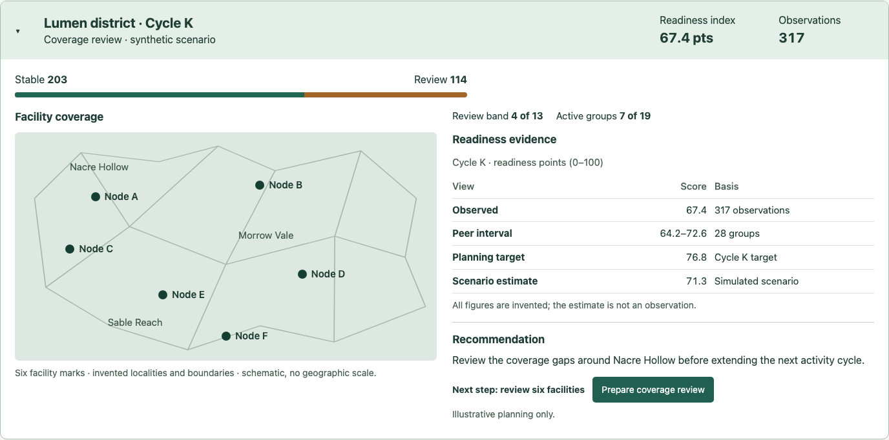

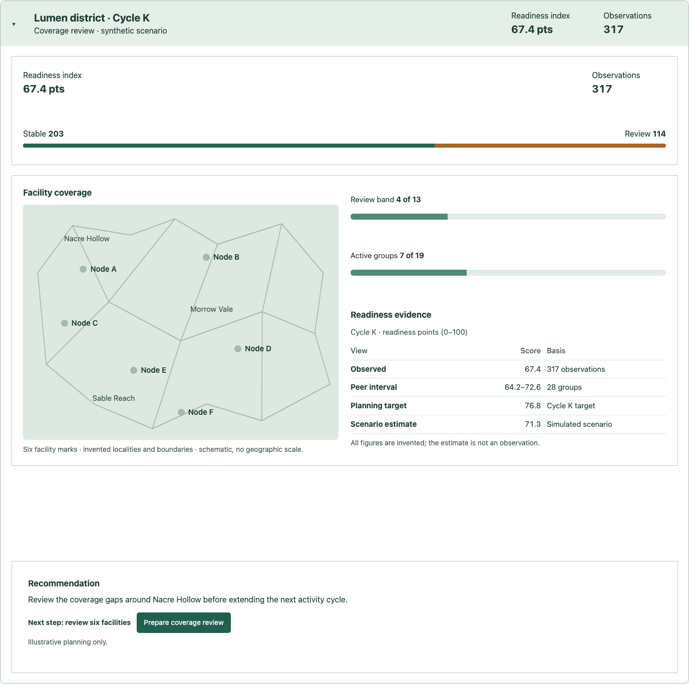

This example is entirely invented: generic operations coverage, fictional locality
names, schematic boundaries without real coordinates, six facilities, and synthetic
counts and readiness scores. A single HTML template supplies both versions. It
contains no source screenshot, source data, external map tiles, or network dependency.
The good version retains the same evidence and action, but consolidates the headline
summary and turns two large single-value tracks into compact context. The bad version
repeats headline metrics and separates the recommendation with empty space.

The map occupies roughly half the evidence width in both versions and remains at
least 480×340 CSS px at the configured 1440×1100 desktop viewport. The good map is
not a thumbnail: facilities and invented locality labels retain their reading size.
The fixture keeps 14px minimum text, with a 16px recommendation, in both versions.
These sizes are task-scoped examples, not universal map or density thresholds.

| Lesson | Executable boundary | Human review remains necessary |
| --- | --- | --- |
| Region utilization | Existing `region-density`: summary text coverage ≥ 0.06 and empty vertical band ≤ 48 CSS px | Useful information and map information yield cannot be inferred from occupancy |
| Summary duplication | `repeated-metric`: each declared headline identity occurs at most once in its own decision surface; both identities are required | Semantic equivalence, annotation completeness, and justified repetition |
| Evidence/decision proximity | `evidence-proximity`: distance between text bounds ≤ 80 CSS px | Whether that evidence supports the recommendation; simultaneous visibility and occlusion |
| Scalar context | Existing `max-height`: declared scalar containers ≤ 56 CSS px | Whether the display is actually a scalar; rich multi-value plots need different scope |
| Mark visibility | `mark-contrast`: opaque CSS facility background versus its containing solid map background ≥ 3:1 | Complex terrain, gradients, image/SVG/canvas paint, sibling layers, thin marks, and palette semantics |

The 3:1 threshold is informed by [W3C non-text contrast guidance](https://www.w3.org/WAI/WCAG22/Understanding/non-text-contrast.html)
for meaningful graphical objects; this partial model does not certify WCAG conformance.
The layout interpretations follow [Tufte's discussion of graphical economy and comparison](https://www.edwardtufte.com/book/the-visual-display-of-quantitative-information/).
Neither source prescribes this fixture's dimensions or density targets.

Use [the config](examples/decision-config.json) with [the rules](examples/decision-rules.json)
on the local preview server. The config captures the individual versions so each
density region resolves exactly once. Copy the JSON files to `.ui-review/config.json`
and `.ui-review/rules.json` in a **separate scratch project**, copy the
[rationale](examples/decision-rationale.md) to `docs/examples/decision-rationale.md`, and adapt `sourcePaths` to
that project, and run `viewrule contract` then `viewrule check`. The combined config
intentionally exits 1 because the bad route fails. Restrict `pages` to `good` to
inspect its clean pass. Do not replace a real application's existing contract.

The same packed-CLI regression checks both versions using unchanged rules, exact
finding IDs and citations, required evidence, six measured contrasts, preserved map
size/content/type, and the explicit unassessed result for unsupported paint. Captures
are original-size evidence, not pixel snapshot assertions. `images/decision/captures.json`
records browser version, CSS viewport, device scale, and layout measurements.
