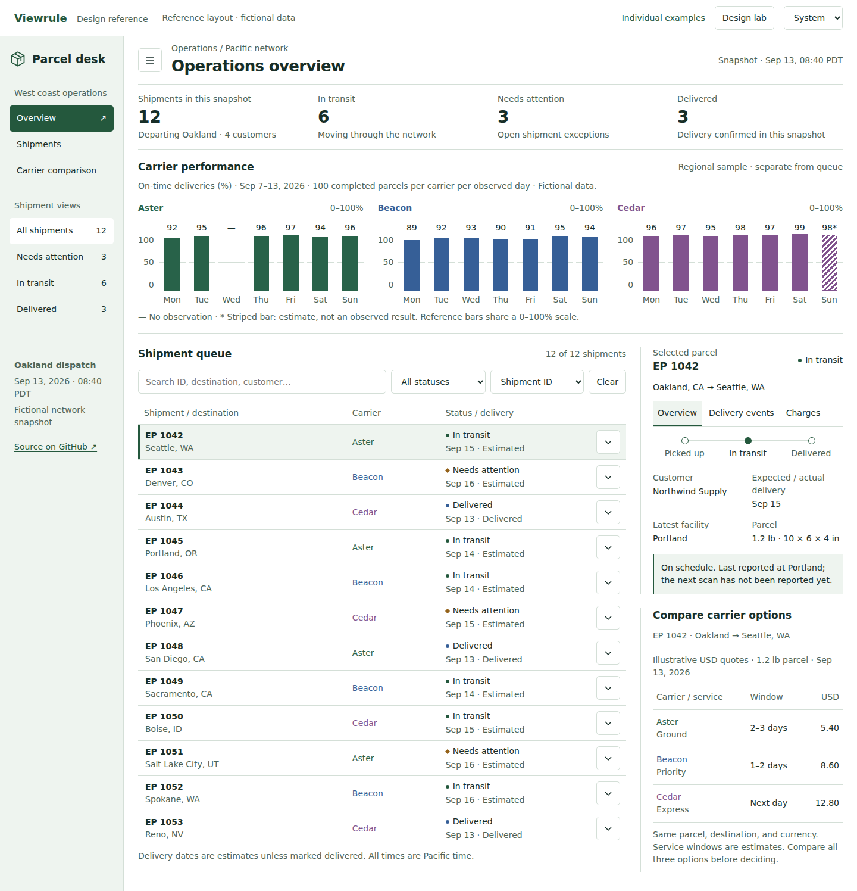
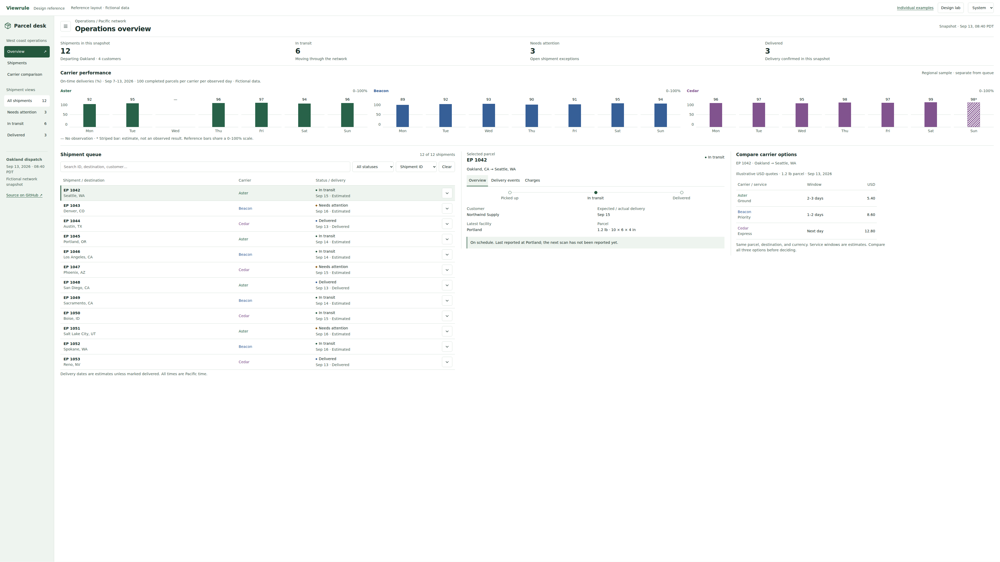
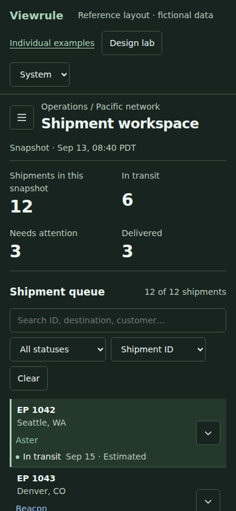

# Parcel desk: a complete design reference

The mock application combines the design elements into one task: monitor a parcel
network, find a shipment that needs attention, inspect its context, and compare
carrier options. Everything uses deterministic fictional data. No account, API,
real shipment, or backend is involved.

The GitHub Pages entry point is `https://lanej.github.io/viewrule/`, with the app
under `/app/` and the component gallery under `/examples/`. Deployment status is
shown by the `pages` job in [the existing workflow](https://github.com/lanej/viewrule/actions/workflows/ci.yml).

## Try the workflow

1. Open **Overview** to compare carrier performance. Each reference chart uses
   0–100%, with the units, period, population, and fictional source alongside it.
2. Choose **Needs attention** in the sidebar. The queue, count, and selected parcel
   respond to the filter. Search an ID, destination, customer, or carrier; sort by
   shipment ID or destination. Clear restores the unfiltered queue.
3. Select **EP 1047**, expand its row, and inspect the journey, latest facility,
   and address issue. Switch to **Delivery events** or **Charges**; arrow keys,
   Home, and End work in the tab bar.
4. Open **Carrier comparison** to inspect three offers for the same selected
   parcel. Amounts retain their currency, precision, and common right edge.
5. Open **Design lab**, enable a defect, then close the panel. Restore the
   reference to compare the same data, filters, selected parcel, and open drawers.

The hamburger opens or closes navigation. At mobile widths it begins closed;
when opened, navigation occupies its own space above the task. Escape closes the
Design lab first, then navigation, and returns focus to the relevant trigger.
The theme can follow the system or be set explicitly.

The URL preserves the page, filter, search, sorting, selection, tab, theme, navigation,
expanded rows, and deliberate defects. Copy the address to share a reproducible
state. For example, `/app/?defects=framing,tabs&parcel=EP%201047&tab=events`.
The Design lab itself starts closed on reload so the application is visible.
Changes are local to the browser and are not saved as human design approvals.



## How the design rules appear

| Rule | Reference behavior | Deliberate defect | Detection and limits |
| --- | --- | --- | --- |
| [DR-001](design-rules.md#dr-001--comparable-charts-use-comparable-scales) | Three daily on-time charts share a domain, period, and plotting height | Independently rescale carrier bars | `app-shared-scale` checks renderer-declared domains. Inspect the actual marks too. |
| [DR-002](design-rules.md#dr-002--visual-magnitude-reflects-numerical-magnitude) | Ordinary bars start at zero | Start two charts at 80% and 90% | `app-zero-baseline` checks metadata generated from the same baseline used to size bars. Metadata cannot certify graphical truth. |
| [DR-003](design-rules.md#dr-003--quantities-carry-the-context-needed-to-interpret-them) | Units, period, denominator, and source stay visible | Hide the shared chart context | `app-chart-context` requires visible nonempty context. It does not validate its meaning. |
| [DR-004](design-rules.md#dr-004--missing-and-estimated-values-remain-distinguishable) | Aster's missing Wednesday is a dash; Cedar's Sunday estimate is striped and labeled | Render missing as zero and the estimate as observed | Human/domain review. The bundled contract does not automatically detect this semantic defect. |
| [DR-005](design-rules.md#dr-005--visual-meanings-stay-consistent) | Carriers keep the same labeled colors in charts, queue, and quotes | Swap two carrier colors only in quotes | Human review in this contract. A scoped style-consistency rule can enforce an application's declared mapping. |
| [DR-006](design-rules.md#dr-006--related-evidence-stays-visible-together) | Navigation has its own space; full tab labels and aligned quote amounts retain context | Overlap navigation, truncate tabs, or left-align amounts | `app-navigation-context`, `app-complete-tabs`, and `app-amount-alignment` check the declared geometry/styles. |
| [DR-007](design-rules.md#dr-007--larger-screens-expose-useful-detail-and-preserve-legibility) | Readable type and controls; larger screens expose quotes alongside the task | Fade supporting text | Built-in axe contrast checks and a scoped control-bounds warning. These do not prove overall density or usefulness. |
| [DR-008](design-rules.md#dr-008--decoration-earns-its-space-and-visual-weight) | A bounded heading leaves room for the task | Inflate header and shipment-row padding | `app-bounded-framing` applies a project-specific 112 CSS px heading limit at the configured desktop sizes. |

“Reference” describes the intended example. It is not a certification that every
possible layout state or design principle passes. Defect switches change presentation;
they never rewrite the fixture observations. The Design lab explains the relevant
checks but does not execute the Node/Playwright engine in the browser.

## Viewport behavior and evidence

The application uses native CSS pixels with 14px body text. It reflows below 1200px
and moves navigation above the task below 800px. At 1800px and wider, the queue,
selected parcel, and quotes use three adjacent columns. This exposes existing
useful context without inventing more data. Charts remain comparable across widths.

The screenshots use device scale 1. Full-height screenshots do not imply that every
element fits in the initial viewport. Open images at their original size when
checking text and alignment; a scaled overview loses detail.





## Develop and assess it

From a source checkout with Node 22.13+:

```sh
npm ci
npm run site:preview
# Open http://127.0.0.1:4173/app/
```

The preview builds once and serves locally; rerun it after changing source.
`npm run site:build` writes the same static site to `dist/site`. The mock uses browser
ES modules, so open it through HTTP rather than `file://`. The original component
gallery remains usable directly from a local file.

The app has its own example contract in `app/.ui-review/`. With the preview running
in another terminal:

```sh
cd docs/app
node ../../bin/viewrule.mjs contract
node ../../bin/viewrule.mjs check
```

Install Chromium once with `node bin/viewrule.mjs install-browser` from the repository
root. The supplied configuration assesses the reference Overview at 1440×1000 and
3840×2160 CSS px. To assess a defect, put its query string in the configured page
path and keep the rule limits unchanged. Other pages need their own scoped contract:
for example, the Shipments page intentionally hides the performance charts.

## Architecture and lifecycle

| File | Responsibility |
| --- | --- |
| `app/index.html` | Semantic application shell and templates for rows, charts, quotes, and defect controls |
| `app/data.js` | Twelve fictional shipments, three carrier series, and defect descriptions |
| `app/app.js` | Validated URL state, shared interactions, template cloning, text insertion, and chart rendering |
| `app/app.css` | Theme tokens, responsive composition, and isolated defect styles |
| `app/.ui-review/` | Example application expectations; independent of engine defaults |
| `../scripts/site.mjs` | Explicit public-asset build and optional local HTTP preview |
| `../.github/workflows/ci.yml` | Existing regression gate followed by Pages deployment on main |

There are no frontend dependencies or compilation step. Static assets use relative
URLs so the site works under the repository's Pages path. The site build includes
the application and component gallery; review configuration and local evidence are
not deployed. Links to policy/manual Markdown go to their rendered GitHub pages.

`npm run check` formats, lints, and statically checks the application. The existing
installed-package regression includes one mock-app scenario: accept the reference,
assert specific findings from deliberate violations, and exercise the connected
interaction workflow. There is no second test suite or screenshot assertion matrix.

On pushes to main, the `pages` job follows the regression job, builds the static
site, and deploys it with the official Pages actions. It also supports manual runs
through **Run workflow**. Initial enablement is attempted through `configure-pages`.
If GitHub denies that repository settings operation, a repository administrator
must select **GitHub Actions** in **Settings → Pages → Build and deployment → Source**,
then rerun the failed Pages job. No personal token is embedded in the workflow.

Publishing this site does not publish a new engine release or change the Claude
plugin's pinned v0.2.0 archive. Update the mock, its contract, its screenshot evidence,
and this guide together when changing the illustrated boundaries.
